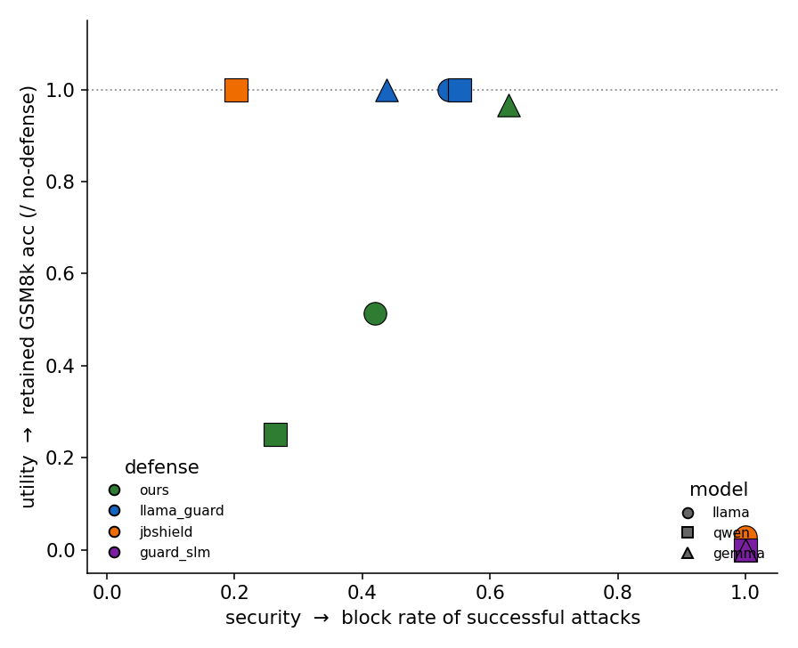
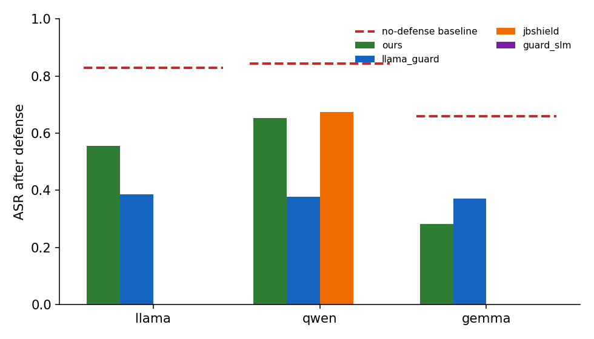
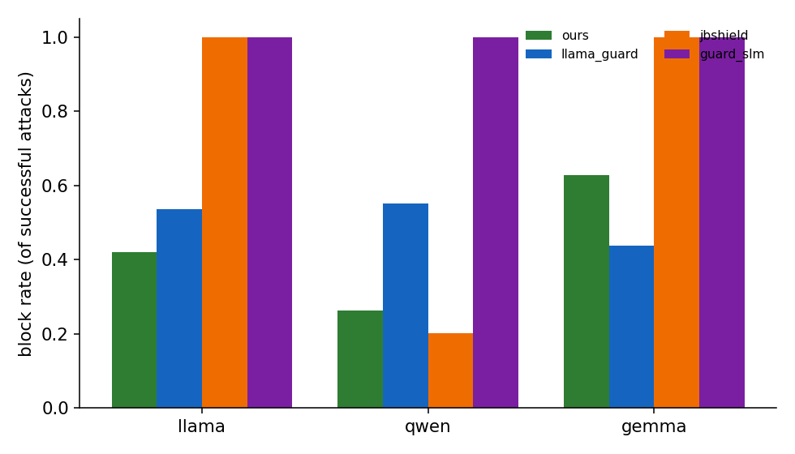
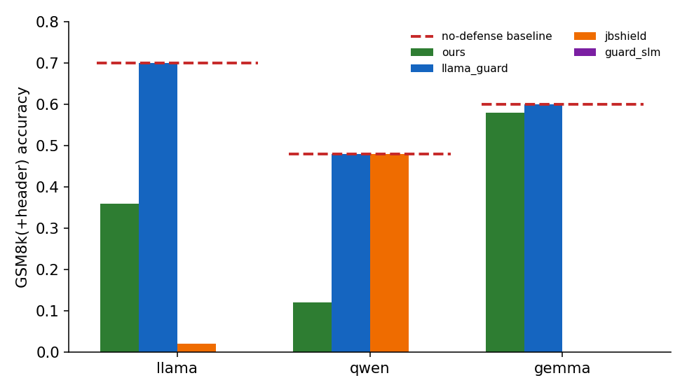
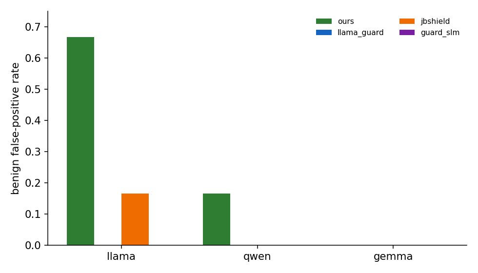

# experiments_defense — choan.md §4 다중 모델 방어 비교 리포트

> **질문 (choan.md §4)** : *"diff-means + ±1-token-drop" 토큰 단위 sanitizing 방어가
> 모델 전반에 적용 가능한가? 기존 방어 기법들과 비교하면 어떤가?*
>
> **main contribution** : prompt 단위 거절(detect→refuse)이 아니라 **token 단위
> detect→sanitize** 로 방어함으로써 **utility를 확보**한다. 또한 분류기 학습이나
> 2차 추론 없이 동작하여 overhead가 작다.

- **run** : `def_all` · **데이터 소스** : [`results/def_all/summary.json`](../results/def_all/summary.json)
- **모델 (3)** : `llama` (Llama-3.1-8B-Instruct), `qwen` (Qwen2.5-7B-Instruct), `gemma` (Gemma-2-9B-it)
  - *(choan.md §4의 Mistral-7B-Instruct-v0.3은 이번 run에 미포함 — 추가 실행 필요)*
- **방어 (4)** : `ours`(token sanitize) · `llama_guard` · `jbshield` · `guard_slm` (뒤 셋은 prompt-level refuse)
- **프롬프트 셋 (2)** : MetaBreak TM-1 공격(mimicry) 135개 / GSM8k(+mimicry 헤더) 50개 · benign 6개(FPR 통제)

---

## 0. 한눈에 보기 — 보안 vs utility 트레이드오프



가로축(오른쪽일수록 좋음) = **보안**(원래 성공하던 공격 중 차단한 비율), 세로축(위일수록 좋음)
= **utility**(GSM8k+헤더 정확도를 no-defense 대비 보존한 비율, 점선 1.0 = 완전 보존).
색 = 방어, 모양 = 모델. **오른쪽 위 모서리가 이상점.**

핵심 그림이다. 네 방어가 서로 다른 영역을 차지한다.

- **`guard_slm`(보라)** — 세 모델 모두 **(1.0, 0.0)**. 공격은 100% 막지만 GSM8k 정답률이
  0. 즉 **헤더가 붙은 입력을 전부 거절** → 완벽한 보안, **utility 전무**.
- **`jbshield`(주황)** — llama·gemma는 **(1.0, 0.0)** 으로 guard_slm과 동일한 "전부 거절"
  실패 모드. qwen만 **(0.20, 1.0)** — 거의 못 막지만 utility는 살아있음. 즉 **모델 간
  일관성이 없다**(전이 실패).
- **`llama_guard`(파랑)** — 세 모델 모두 **utility 1.0** 을 유지하면서 보안 **0.44–0.55**.
  의미 기반 분류라 "수학 문제(헤더만 공격처럼 생김)"를 안전으로 판단 → 거절하지 않음.
  **utility는 완벽, 보안은 중간.**
- **`ours`(초록)** — 유일하게 **중간 영역에 분산**. gemma **(0.63, 0.96)** 으로 우상단에
  가장 근접(utility 거의 보존 + 가장 높은 보안), llama **(0.42, 0.51)**, qwen
  **(0.26, 0.25)**. 토큰 단위라 프롬프트를 통째로 버리지 않지만, 헤더 프롬프트에서
  토큰을 과다하게 drop하면 수학 정확도가 깎인다(모델 의존적).

> **요약** : prompt-level refuse 계열은 "전부 막고 utility를 0으로 만드는" 극단(guard_slm,
> jbshield) 또는 "utility는 완벽하나 보안은 중간"(llama_guard)에 머문다. `ours`만이
> **토큰 단위 거래**를 통해 두 축의 중간 지점을 점유하며, 모델에 따라(특히 gemma)
> 우상단으로 이동한다 — 이것이 choan.md의 main contribution을 직접 보여준다.

---

## 1. 공격 차단 성능

### 1.1 방어 후 ASR (낮을수록 좋음)



빨간 점선 = no-defense 기준 ASR(`asr_before`). 막대 = 각 방어 후 ASR. `jbshield`/`guard_slm`의
0 값은 막대가 보이지 않음(= 완전 차단).

| model | asr_before | ours | llama_guard | jbshield | guard_slm |
|---|---|---|---|---|---|
| llama | 0.830 | 0.556 | 0.385 | **0.000** | **0.000** |
| qwen  | 0.844 | 0.652 | 0.378 | 0.674 | **0.000** |
| gemma | 0.659 | 0.281 | 0.370 | **0.000** | **0.000** |

- 기준 ASR이 **0.66–0.84** 로 MetaBreak 공격이 세 모델 모두에서 매우 잘 통한다(특히 qwen 0.844).
- `guard_slm`은 모든 모델 0.000 — 단, §0에서 보았듯 utility까지 0이라 "막은 것"의 의미가 약하다.
- `jbshield`는 llama/gemma 0.000이지만 **qwen에서 0.674** 로 사실상 무력 — 단일 임계값이 모델
  간 전이되지 않음.
- `ours`/`llama_guard`는 **온건하게** ASR을 낮춘다(거절형이 아니므로). `ours`는 gemma에서
  0.659→0.281로 가장 크게 낮췄고, llama_guard는 세 모델에서 0.37–0.39로 안정적.

### 1.2 원래 성공하던 공격 중 차단 비율 (높을수록 좋음)



`block_rate_among_successful` = baseline에서 성공했던 공격을 방어가 무력화한 비율.

| model | ours | llama_guard | jbshield | guard_slm |
|---|---|---|---|---|
| llama | 0.420 | 0.536 | **1.000** | **1.000** |
| qwen  | 0.263 | **0.553** | 0.202 | **1.000** |
| gemma | 0.629 | 0.438 | **1.000** | **1.000** |

- `ours`의 차단력은 **모델 의존적**: gemma 0.629 > llama 0.420 > qwen 0.263. qwen에서 약한
  이유는 ours의 임계값 calibration(아래 §4)과 일치한다.
- `llama_guard`는 0.44–0.55로 모델 무관하게 일관적.
- 1.000 차단(guard_slm 전부, jbshield llama/gemma)은 §3의 utility와 반드시 함께 읽어야 한다.

---

## 2. Utility — GSM8k(+mimicry 헤더) 정확도 (높을수록 좋음)



빨간 점선 = no-defense에 헤더만 붙인 정확도(`hdr_nodef`). 막대 = 방어 적용 후. 점선에 가까울수록
방어가 utility를 보존한 것.

| model | plain | hdr_nodef | ours | llama_guard | jbshield | guard_slm |
|---|---|---|---|---|---|---|
| llama | 0.700 | 0.700 | 0.360 | **0.700** | 0.020 | 0.000 |
| qwen  | 0.440 | 0.480 | 0.120 | **0.480** | **0.480** | 0.000 |
| gemma | 0.700 | 0.600 | 0.580 | **0.600** | 0.000 | 0.000 |

- **헤더 자체는 utility를 거의 망가뜨리지 않는다** (plain≈hdr_nodef: llama 0.70/0.70,
  qwen 0.44/0.48, gemma 0.70/0.60). 즉 아래의 utility 손실은 **헤더가 아니라 방어 때문**이다.
- **`guard_slm` = 모든 모델 0.000** : 헤더가 붙은 수학 문제를 전부 거절 → utility 완전 붕괴.
- **`jbshield`** : llama 0.020 / gemma 0.000(거절)으로 붕괴, qwen만 0.480(헤더 무시하고 통과)으로
  보존 — §1과 정확히 반대 패턴(qwen은 못 막는 대신 utility 살림). 일관성 없음.
- **`llama_guard` = hdr_nodef와 동일(0.700/0.480/0.600)** : 의미 기반이라 수학 문제는 안전으로
  보고 그대로 통과 → **utility 완벽 보존**.
- **`ours`** : 거절은 0이지만 토큰 drop으로 정확도가 깎인다. **gemma 0.580(≈0.600 거의 보존)**,
  llama 0.360, **qwen 0.120(큰 손실)**. 손실 원인은 §3에서 보는 헤더 프롬프트 flag_rate=1.0
  (모든 헤더 입력에서 토큰을 drop)에서 온다.

> prompt-level 거절형(guard_slm, jbshield)이 보안 1.0을 달성하는 대가로 utility를 0으로 만드는
> 모습이 choan.md가 경고한 실패 모드다. `llama_guard`(의미 분류)와 `ours`(토큰 sanitize)만이
> utility를 유지하는 방향의 방어다.

---

## 3. Benign 오탐률 (낮을수록 좋음)



benign 프롬프트를 거절한 비율(prompt-level) — `ours`는 거절 대신 **flag_rate**(토큰을 표시/drop)를 보고함.

| model | ours | llama_guard | jbshield | guard_slm |
|---|---|---|---|---|
| llama | **0.667** | 0.000 | 0.167 | 0.000 |
| qwen  | 0.167 | 0.000 | 0.000 | 0.000 |
| gemma | 0.000 | 0.000 | 0.000 | 0.000 |

- benign 테스트 셋이 **6개뿐**이라 해상도가 거칠다(1/6 = 0.167 단위). 절대값보다 경향으로 읽을 것.
- `ours`는 **llama에서 0.667** 로 benign 토큰을 과다 표시 — llama의 ours 임계값이 너무 공격적임을
  시사(§4의 layer 0, threshold −0.067과 일치). gemma는 0.000으로 깨끗.
- `jbshield`는 llama에서 0.167 오탐. 나머지 거절형은 benign에는 0.000 — 단, 이는 §2에서 본
  "GSM8k+헤더는 전부 거절"과 모순되지 않는다: 헤더가 없는 순수 benign은 통과시키지만,
  **헤더가 붙는 순간 거절**한다는 뜻(= 헤더에만 반응하는 얕은 방어).

---

## 4. 방어별 calibration 상세 (`prepare.json`)

학습은 **TRAIN split에서만** 수행. 모든 방어의 `train_auc`가 ≈1.0인데도 test 거동이 갈리는 점이
중요하다 — **train에서 완벽히 분리돼도 test/모델 전이에서 무너질 수 있다**(choan.md §2.2의
"train set에서만 효과적" 경고와 동일).

| model | ours layer / threshold | jbshield (toxic / jailbreak layer, auc) | guard_slm layer / C |
|---|---|---|---|
| llama | 0 / −0.067 (FPR 0.01) | 32 (auc 0.9998) / 1 (auc 1.0) | 1 / 1.0 |
| qwen  | 1 / −0.563 | 19 (auc 0.9975) / 1 (auc 1.0) | 1 / 1.0 |
| gemma | 0 / 46.265 | 42 (auc 0.9986) / 1 (auc 1.0) | 1 / 1.0 |

- **`ours`** : 모델마다 layer(0/1/0)와 threshold 스케일(−0.067, −0.563, 46.3)이 크게 다르다 —
  diff-means 방향의 절대 스케일이 모델별로 달라 임계값을 모델별로 fit해야 함. llama threshold가
  benign까지 잡는 쪽으로 치우쳐 §3의 0.667 오탐을 설명.
- **`jbshield`** : "toxic ∧ jailbreak 두 방향 동시 활성화 → 거절". train AUC가 거의 1인데
  qwen test에서 무력(§1)/utility 보존(§2)인 것은 두 개념 임계값이 qwen 분포에 과적합돼
  test 공격에서 동시 활성화가 안 일어났음을 뜻함.
- **`guard_slm`** : layer-1 last-token SVM, train AUC 1.0. 그러나 test에서 **모든 헤더 입력을
  malicious로 판정** → 사실상 "헤더 탐지기"로 붕괴(보안 1.0 / utility 0.0).

**데이터 규모(`manifest.json`)** : 모델별 공격 train 315 / test 135, benign train 14 / test 6,
GSM8k 50. mimicry 재적용은 이번 run에선 모두 `mimicked=false`(literal-special 형태). benign train이
14개로 작고 공격 315개와 **클래스 불균형**이 커, 거절형 임계값이 한쪽으로 쏠리기 쉬운 조건이다.

---

## 5. 종합 결론

1. **`ours` (token sanitize)** — 유일하게 보안·utility를 **토큰 단위로 거래**하는 방어.
   거절을 하지 않으므로 utility를 살릴 여지가 있고(gemma 0.58/0.60, 보안 0.63), 분류기·2차 추론
   없이 hidden state 1회 관찰로 동작해 **overhead가 작다**(main contribution). 다만 손실이
   **모델 의존적**(gemma 우수 ↔ qwen utility 0.12, llama benign 오탐 0.667)이라 모델별 임계값/
   layer 튜닝이 필요하다.
2. **`llama_guard`** — utility 완벽 보존 + 보안 중간(0.37–0.39 ASR). 의미 분류라 "수학+헤더"를
   안전으로 통과. 단 별도 8B guard 모델 추론 비용이 든다.
3. **`jbshield`** — llama/gemma는 완전 차단하나 utility 0, qwen은 거의 무력. **모델 전이 실패**로
   현 calibration으로는 실용성 낮음.
4. **`guard_slm`** — 모든 모델에서 "헤더가 붙은 입력 전부 거절"로 붕괴. 보안 1.0이지만 utility 0,
   **자명한 방어**에 가깝다.

> choan.md §4의 답: 토큰 단위 sanitizing은 **세 모델 모두에 적용 가능**하지만 효과는 모델
> 의존적이다. **거절형이 utility를 0으로 만드는 실패 모드를 피하면서 보안·utility 중간을 점유하는
> 유일한 방어**라는 점이 핵심 기여를 뒷받침한다. 다음 단계: (a) Mistral 추가, (b) `ours`의
> 모델별 임계값/layer 안정화로 qwen·llama의 utility·오탐 개선, (c) benign test 셋 확대.

---

### 부록 — 그림 재생성

```bash
/home/hcchoo/miniconda3/envs/myenv/bin/python reports/make_figures.py
# results/def_all/summary.json → reports/figures/fig{1..5}_*.png
```
