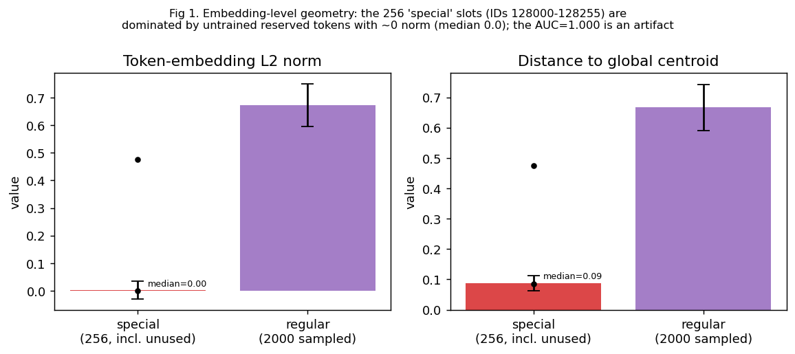
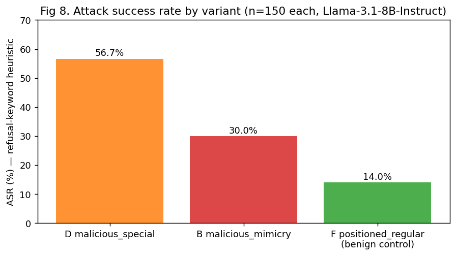
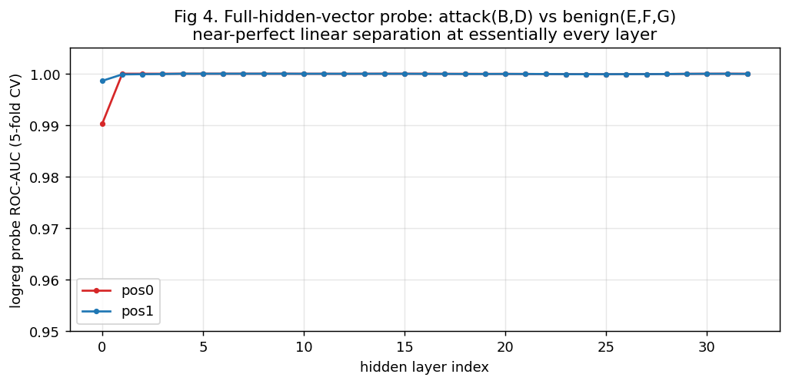
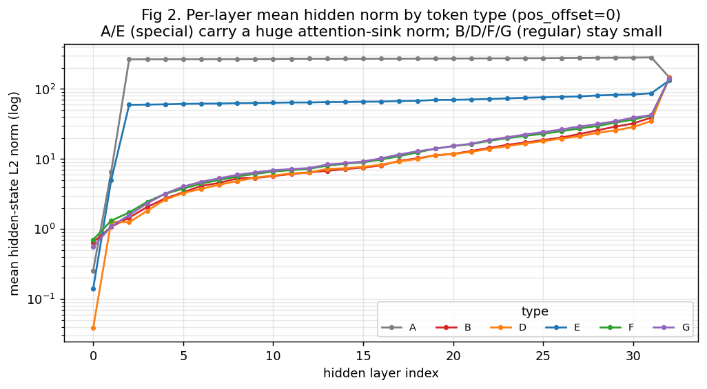
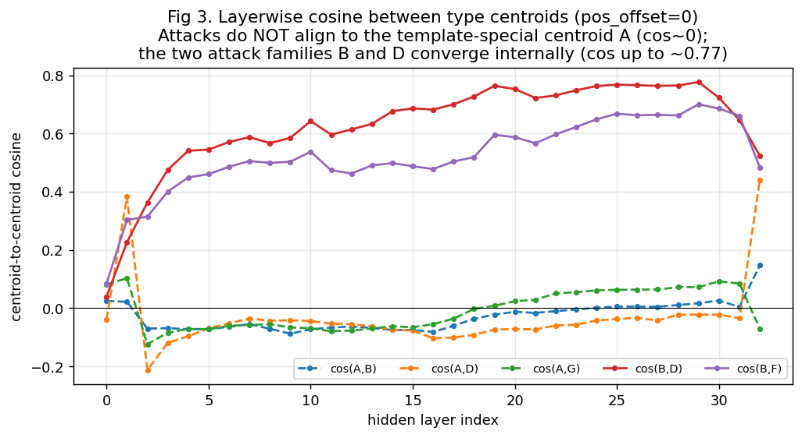
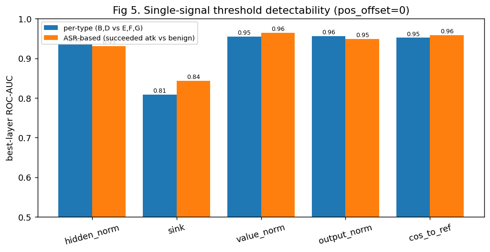
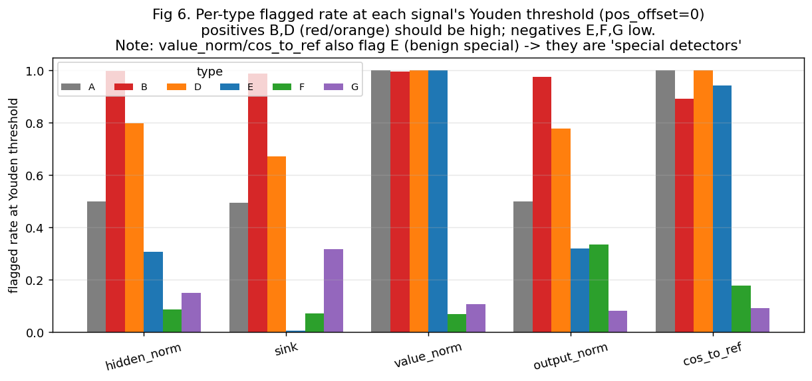
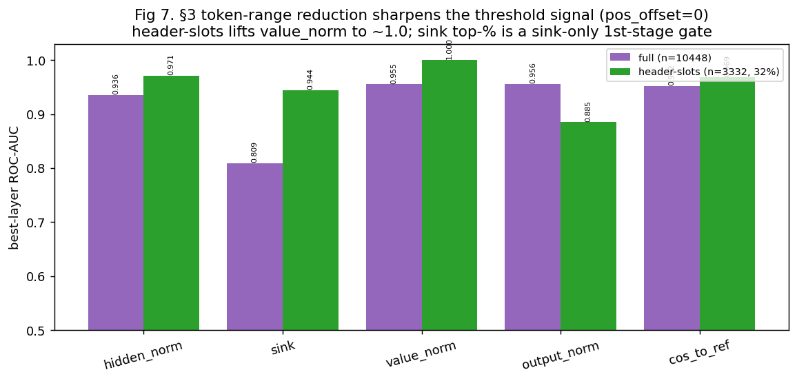

# experiment_hc_1 분석 리포트 — MetaBreak Semantic-Mimicry 공격의 내부표현 기반 방어 가능성

> **대상 모델**: Llama-3.1-8B-Instruct (vocab 128,256 · hidden 4,096 · 32 transformer layer)
> **구현 범위**: `Main.md` §1–§3 (§4 cascade 방어는 본 리포트에서 *설계 제안*까지만)
> **분석 산출물 경로**: `experiments_hc_1/results/hc1_llama31_8b/`
> **작성일**: 2026-06-04 · 독자: 지도교수·연구노트
> **표본**: 공격/통제 토큰 20,896개(census), 측정 위치 pos0(공격 슬롯)·pos1(다음 토큰)

---

## 0. 한 페이지 요약 (Executive Summary)

이 실험은 "**MetaBreak의 semantic-mimicry 공격을, victim 모델 *내부에서* 흘러가는 신호만 보고 탐지·방어할 수 있는가?**"를 묻는다. 결과를 다섯 문장으로 압축하면:

1. **임베딩(입력) 단계만으로는 안 된다.** special 토큰과 regular 토큰을 임베딩 norm으로 가르는 AUC가 0.9999로 나오지만, 이는 Llama가 *학습에 쓰지 않은 예약(reserved) special 슬롯 ~250개가 거의 0 벡터*이기 때문에 생긴 **착시**다. 실제로 쓰이는 special 토큰은 regular와 분포가 겹친다 → **내부표현을 봐야 한다.** (Fig 1)

2. **내부표현에서는 공격이 또렷이 보인다.** hidden state 전체 벡터로 로지스틱 회귀 probe를 학습하면 공격(B,D) vs 정상(E,F,G)을 **거의 모든 레이어에서 ROC-AUC ≈ 1.0**으로 분리한다. (Fig 4)

3. **공격은 "특수 토큰 흉내"의 형태로 내부에 각인된다.** 공격 토큰은 chat-template special 토큰의 중심점(A)을 *cosine으로 흉내내지는 않지만*(cos(A,B)≈0), 두 공격 계열(B: regular mimicry, D: literal special)은 **중간 레이어에서 서로 수렴**한다(cos(B,D)가 0.04→0.77). 또한 special 토큰 특유의 **거대한 attention-sink norm**을 mimicry 토큰(B)이 물려받는다. (Fig 2, Fig 3)

4. **단일 신호 threshold도 AUC ~0.95까지 가능하지만, 함정이 있다.** `value_norm`·`cos_to_ref` 같은 최고 신호는 사실상 "**이 토큰이 special처럼 행동하는가**"를 재는 *special 탐지기*라서, **정상 맥락의 special 토큰(E)까지 오탐**한다. 반대로 `sink`·`hidden_norm`은 *악성 special(D)과 정상 special(E)을 구분*한다(맥락 민감). (Fig 5, Fig 6)

5. **"볼 토큰 범위"를 좁히면 신호가 급격히 선명해진다.** sink 기반으로 헤더-슬롯 토큰(전체의 31.9%)만 보면 `value_norm`의 AUC가 **0.99997**까지 올라간다. 이것이 §3의 핵심이자 §4 cascade 방어의 1차 거름 근거다. (Fig 7)

> **가장 중요한 한계**: 토큰-정체성 통제군 **C(benign mimicry)가 토큰 census에 0개로 누락**되었다. 즉 "같은 치환 토큰을 *정상 맥락*에 둔 경우"라는 핵심 대조군이 비어 있어, "공격성이 토큰 정체성 자체에서 오는가 vs 맥락에서 오는가"를 완전히 분리하지 못했다(§7 참조). 재실행 시 최우선 보완 대상.

---

## 1. 배경 지식 — 기초부터

### 1.1 무엇을 막으려 하는가: MetaBreak semantic-mimicry 공격
대형 언어모델(LLM)은 대화를 **chat template**라는 고정 형식으로 받는다. Llama-3.1의 경우 한 턴은 대략 이렇게 생겼다:

```
<|start_header_id|>user<|end_header_id|>
...사용자 내용...<|eot_id|>
<|start_header_id|>assistant<|end_header_id|>
```

여기서 `<|start_header_id|>`, `<|eot_id|>` 같은 토큰을 **special token**이라 부른다. 이들은 "여기서부터 시스템이 정한 구조다"라는 **제어 신호**다. 모델은 이 토큰을 보고 "지금은 사용자 발화 영역", "지금부터 어시스턴트가 답할 차례" 같은 *역할·경계*를 인식한다.

**MetaBreak의 아이디어**: 공격자는 시스템만 써야 할 이 제어 구조를 *사용자 입력 안에서 위조*해 모델을 속인다. 그런데 진짜 special token(예: `<|eot_id|>`)을 그대로 넣으면 토크나이저나 입력 정제 단계에서 걸러질 수 있다. 그래서 **semantic mimicry(의미적 흉내)**를 쓴다 — 진짜 special 토큰과 임베딩 공간에서 매우 가까운 *평범한(regular) 토큰*을 찾아 그 자리에 끼워 넣는 것이다. 이 코드베이스에서 mimicry 치환 토큰의 예가 `ujících`, `�` 같은 것들이다(`results/llama/replacement.json` 기반). 모델 입장에서는 "regular 토큰인데 special처럼 보이는" 입력을 받아, 결과적으로 구조 경계가 무너지고 안전장치가 우회된다.

### 1.2 두 갈래의 공격 토큰
- **literal special을 직접 사용** → 본 실험의 타입 **D (malicious special)**
- **special을 흉내낸 regular 토큰으로 치환** → 본 실험의 타입 **B (malicious mimicry)** — MetaBreak의 진짜 핵심 수법

### 1.3 "내부표현"이란 무엇인가
LLM은 입력 토큰을 받아 32개 layer를 거치며 각 토큰 위치마다 4,096차원 벡터(**hidden state**)를 갱신한다. 같은 단어라도 *문맥에 따라* 이 벡터가 달라진다 — 이것이 "internal representation(내부표현)"이다. 입력 임베딩(layer 0)이 "사전적 정체성"이라면, 깊은 layer의 hidden state는 "문맥 속 의미·역할"을 담는다. 이 실험의 가설은 **"공격 토큰은 입력 단계에서는 정상처럼 보여도, 모델 내부를 흐르며 special 토큰 특유의 흔적을 남긴다"**는 것이다.

### 1.4 측정하는 5가지 신호 (왜 이것들인가)
| 신호 | 정의 | 직관 |
|---|---|---|
| `hidden_norm` | hidden state 벡터의 L2 노름 ‖h‖ | special/sink 토큰은 노름이 비정상적으로 큼 |
| `sink` | attention sink score | 많은 토큰이 이 위치로 attention을 "쏟아내는" 정도. special 토큰의 대표적 특징 |
| `value_norm` | attention의 value 벡터 노름 ‖v‖ | 이 토큰이 다른 토큰에 *전달하는 정보량*의 크기 |
| `output_norm` | attention 출력(o_proj 입력) 노름 | 이 위치가 attention을 통해 내보내는 신호 세기 |
| `cos_to_ref` | hidden state와 **A(템플릿 special) 중심점**의 cosine | "이 토큰이 진짜 special의 방향을 닮았는가" |

> **Attention sink란?** 트랜스포머는 종종 문장 맨 앞 토큰이나 특정 special 토큰에 attention을 과도하게 몰아주고, 그 토큰의 hidden norm이 다른 토큰보다 수십~수백 배 커지는 현상을 보인다. 이를 attention sink라 한다. special 토큰은 전형적인 sink다. **mimicry 공격이 special을 "흉내"낸다면 이 sink 특성도 일부 물려받을 것**이라는 게 핵심 추론이며, 실제로 그렇다(§5.4, Fig 2).

---

## 2. 실험 설계

### 2.1 7종 토큰 타입과 통제(control) 논리
이 실험의 가장 영리한 부분은, 단순히 "공격 vs 정상"을 비교하는 데 그치지 않고 **공격성이 ① 토큰의 정체성에서 오는가 ② 위치에서 오는가 ③ 맥락에서 오는가**를 분리하기 위해 통제군을 설계했다는 점이다.

| 기호 | 타입 | 방어 라벨 | 무엇을 통제하나 |
|---|---|---|---|
| **A** | system special (템플릿 special) | reference(기준점) | 진짜 special의 "원점". cos/centroid 기준 |
| **B** | malicious mimicry (공격용 치환 regular) | **positive(공격)** | MetaBreak 핵심 수법 |
| **C** | benign mimicry (정상 맥락의 같은 치환 토큰) | negative | **토큰 정체성 통제** — 같은 토큰을 정상 문장에 두면? |
| **D** | malicious special (literal special 직접 사용) | **positive(공격)** | special 직접 사용 공격 |
| **E** | benign special (정상 맥락에서 언급된 special) | negative | **special 통제** — special이라고 다 공격인가? |
| **F** | positioned regular (공격 슬롯에 넣은 평범한 단어) | negative | **위치 통제** — 공격 위치면 다 위험한가? |
| **G** | ordinary regular (본문의 평범한 토큰) | negative | 본문 baseline |

- **positive(공격) = B ∪ D**, **negative(정상) = C ∪ E ∪ F ∪ G**, A는 reference.
- 이 설계 덕분에, 예컨대 **F가 잘 탐지되지 않고 B만 탐지된다면** "위치 자체가 아니라 공격 토큰의 정체성/거동이 핵심"이라고 말할 수 있다. **E가 D처럼 탐지된다면** 그 신호는 "공격"이 아니라 "special-ness"를 재고 있는 것이다. (이 두 추론이 §5에서 실제로 결정적 역할을 한다.)

### 2.2 측정 위치: pos0 / pos1
공격 토큰이 들어간 슬롯 위치를 **pos0**, 바로 다음 토큰을 **pos1**로 잡아 각각 분석한다. "흔적이 그 자리에 남는지, 다음 토큰으로 번지는지"를 본다.

### 2.3 실제 수집된 데이터 규모 (census)
`extract_summary.json` 기준 토큰 수(pos0+pos1 합산):

| 타입 | 토큰 수 | 비고 |
|---|---|---|
| A system_special | 3,600 | prompt당 최대 2개로 제한 수집 |
| B malicious_mimicry | 2,700 | prompt당 ~9개 |
| D malicious_special | 2,700 | prompt당 ~9개 |
| F positioned_regular | 1,264 | prompt당 ~3개 |
| E benign_special | 312 | seed 데이터 기반, 표본 적음 |
| G ordinary_regular | 10,320 | 본문 baseline |
| **C benign_mimicry** | **0** | **⚠ 누락 — §7 한계 참조** |
| 합계 | 20,896 | 33 hidden layer × 4,096 dim 저장 |

### 2.4 공격 성공 라벨링 (ASR)
각 공격 프롬프트를 실제 모델에 넣어 응답을 생성하고, **거부(refusal) 키워드 휴리스틱**으로 공격 성공 여부(ASR)를 매겼다. Llama-Guard 판정은 이번 실행에서 사용하지 않았다(`guard_model_used=false`). 이 ASR 라벨로 "*실제로 성공한* 공격만 vs 정상" 관점의 분석(ASR-based view)도 병행한다.

---

## 3. 분석 파이프라인 한눈에 보기

| stage | Main.md | 모델 필요 | 핵심 산출물 | 본 리포트 |
|---|---|---|---|---|
| 00 embedding_analysis | §1 | ✓ | `embedding_analysis.*` | §5.1 |
| 01 build_prompts | §2.1 | ✗ | `prompts.jsonl` | §2 |
| 02 run_asr | §2.1 | ✓ | `asr.*`, `asr_summary.json` | §5.2 |
| 03 extract_representations | §2.2/2.3 | ✓ | `tokens.jsonl`, `features.npz` | §2.3 |
| 04 analyze_cosine_logreg | §2.3 | ✗ | `representation_metrics.*`, `cosine_pairs.json` | §5.3–5.5 |
| 05 threshold_defense | §2.3 | ✗ | `threshold_defense.*`, `threshold_per_type.csv` | §5.6 |
| 06 sink_range | §3 | ✗ | `sink_range_report.*` | §5.7 |

---

## 4. 핵심 결과 표

**단일 신호 best-layer ROC-AUC (pos0)** — 값이 1에 가까울수록 그 신호 하나로 공격을 잘 가른다는 뜻.

| 신호 | per-type AUC(B,D vs E,F,G) | best layer | ASR-based AUC | §3 축소 후 AUC |
|---|---|---|---|---|
| hidden_norm | 0.936 | 20 | 0.931 | **0.971** |
| sink | 0.809 | 3 | 0.843 | 0.944 |
| value_norm | 0.955 | 2 | 0.965 | **0.99997** |
| output_norm | 0.956 | 30 | 0.949 | 0.885 |
| cos_to_ref | 0.952 | 32 | 0.958 | 0.969 |
| **logreg (전체 hidden 벡터)** | **≈1.00** | 1~ | — | — |

**ASR (공격 성공률, n=150/변종, 키워드 휴리스틱):** D malicious_special **56.7%** · B malicious_mimicry **30.0%** · F positioned_regular(정상 통제) 14.0%.

---

## 5. 결과 상세 분석

### 5.1 §1 — 임베딩 단계에서는 special을 "norm으로" 가를 수 없다 (착시 주의)



수치(`embedding_analysis.json`):
- L2 norm — special: mean **0.0035**, **median 0.0**; regular: mean 0.672, median 0.685
- 전역 중심점까지 거리 — special: mean 0.088; regular: mean 0.667
- 분리 AUC — by L2 norm **0.9999**, by distance **0.99989**
- special 내부 평균 pairwise cosine **1e-05** (≈ 서로 무상관/영벡터)

표면적으로 AUC가 0.9999이니 "임베딩만으로도 완벽히 가려진다"처럼 보인다. **그러나 이는 거짓 신호다.** Llama-3.1은 토큰 ID 128000–128255의 256칸을 special 슬롯으로 *예약*해 두지만, 실제 학습·사용되는 것은 `<|begin_of_text|>`, `<|eot_id|>`, `<|start_header_id|>`, `<|end_header_id|>` 등 **6개 안팎**뿐이다. 나머지 ~250개는 **훈련되지 않은 거의 0인 벡터**다(median 0.0, within-special cosine 1e-05이 이를 증명). 따라서 "norm이 0에 가까운가"라는 자명한 기준만으로 AUC가 1.0이 나온 것이며, **실제로 의미 있게 쓰이는 special 토큰은 regular 토큰 분포와 겹친다.**

> **자동 생성 노트의 모순 주의**: `embedding_analysis.json`의 `note` 필드에는 "AUC near 0.5 => not separable"이라는 *템플릿 문구*가 박혀 있는데, 실제 산출 AUC(0.9999)와 맞지 않는다. 이 문구는 코드가 결론과 무관하게 출력한 고정 텍스트이므로, 해석은 위 본문(예약 토큰 착시)으로 대체해야 한다. → 결론은 Main.md §1과 동일: **"임베딩 기하로는 못 가른다, 내부표현을 봐야 한다."**

또 하나의 관련 연구 가설("special 토큰이 regular 분포의 깔때기 *바깥*에 산재한다")도, 중심점까지 거리 분포가 특별히 분리되지 않아(역시 0-벡터 착시) **확인되지 않았다.**

### 5.2 §2.1 — 공격 성공률(ASR): literal special이 mimicry보다 강하다



- **D malicious_special 56.7%** > **B malicious_mimicry 30.0%** > F positioned_regular 14.0%
- 해석: literal special을 직접 쓰는 편이 흉내내기보다 공격 성공률이 높다(모델이 진짜 제어 토큰에 더 강하게 반응). 그럼에도 mimicry(B)가 30%나 성공한다는 점이 MetaBreak의 위협을 보여준다.
- **F 14%는 "오탐된 성공"으로 봐야 한다**: F는 공격 슬롯에 평범한 단어를 넣은 *정상 통제군*인데도 14%가 성공으로 집계됐다. 이는 거부-키워드 휴리스틱이 "모델이 거부하지 않으면 성공"으로 세는 과정에서 정상 응답을 공격 성공으로 오인한 잡음이다(§7 한계). 즉 ASR의 절대값보다 **D>B 순서와 상대 격차**에 무게를 둬야 한다.

### 5.3 §2.3-a — 전체 hidden 벡터 probe: 공격은 선형적으로 거의 완벽히 분리된다



hidden state **전체 4,096차원 벡터**로 로지스틱 회귀(5-fold CV)를 학습해 공격(B,D)과 정상(E,F,G)을 분리한 ROC-AUC는 **거의 모든 레이어에서 ≈1.0**이다(`representation_metrics.json`: best layer 1, AUC 1.0, 최저 레이어도 ~0.9999). pos1에서도 유사하게 높다.

이는 두 가지를 말한다:
1. **공격의 흔적은 내부표현에 매우 강하게, 그리고 입력 직후(layer 1)부터** 새겨진다.
2. 단일 스칼라 신호(norm 등)로는 0.95 수준인데 전체 벡터로는 1.0이라는 것은, **공격 정보가 "노름 크기" 하나가 아니라 벡터의 *방향*에도 풍부하게 담겨 있다**는 뜻이다.

> **주의(낙관 보정)**: 이 AUC 1.0은 다소 과대평가일 수 있다. 한 프롬프트에서 B·D 토큰이 9개씩 나오므로, 5-fold CV가 *같은 프롬프트의 토큰을 train/test에 동시에* 넣었다면 정보 누수(leakage)로 점수가 부풀 수 있다. 결론의 방향(분리 가능)은 견고하나, 절대 수치는 prompt-level split로 재검증할 가치가 있다(§7·§8).

### 5.4 §2.3-b — 레이어별 노름: mimicry는 special의 "sink 거동"을 물려받는다



타입별 평균 hidden norm을 레이어별로(로그 스케일) 그린 것이다.
- **A(템플릿 special)**는 layer 2부터 ~265로 폭증 — 전형적 **attention sink**. **E(benign special)**도 ~59로 큰 norm.
- **B·D·F·G(regular 계열)**는 layer 초반 ~1–2에서 출발해 완만히 커진다.
- 마지막 layer 32에서 final RMSNorm 영향으로 모든 타입이 ~140대로 수렴.

여기서 핵심은 **B(mimicry)와 D(malicious special)** 의 거동이다. D는 literal special인데도 A/E만큼 거대 norm을 보이지 않고 B와 비슷한 영역에 있다 — 즉 *공격 슬롯 안에 놓인* special은 템플릿 special(A)과는 다른 거동을 한다(맥락 의존). 그리고 **B는 평범한 regular 토큰임에도, 단일-threshold 분석에서 special처럼 분류된다**(§5.6) — mimicry가 sink/value 특성을 부분적으로 획득했다는 증거다.

### 5.5 §2.3-c — cosine 기하: 공격은 A를 "흉내"내지 않고, 두 공격이 서로 "수렴"한다



중심점-대-중심점 cosine을 레이어별로(`cosine_pairs.json`):
- **cos(A,B) ≈ 0, cos(A,D) ≈ 0, cos(A,G) ≈ 0** — 거의 모든 중간 레이어에서 0 근처(살짝 음수). 즉 **공격 토큰의 hidden 방향은 템플릿 special의 방향을 닮지 않는다.** (단, layer 1과 마지막 layer 32에서 cos(A,D)가 0.38·0.44로 튀는 구간이 있는데, 이는 입력 직후/최종 정규화 구간의 특이성이다.)
- **cos(B,D)는 0.04(layer0) → 0.77(layer29)** 로 꾸준히 상승. **두 공격 계열(regular mimicry와 literal special)이 모델 내부 중간층에서 같은 "공격 표현"으로 수렴**한다는 강력한 신호. 방어 관점에서, 서로 다른 표면형의 공격이 *공통 내부표현*을 공유한다는 것은 단일 탐지기로 둘 다 잡을 수 있다는 희소식이다.
- **cos(B,F)도 0.08 → 0.70** 으로 상승. B와 F(위치 통제)는 *같은 공격 슬롯 위치*를 공유하므로 표현이 어느 정도 닮는다 → **위치가 표현 유사성에 기여**한다. 다만 일반적으로 cos(B,D) > cos(B,F)이므로, **공격 정체성은 위치 효과를 *넘어서는* 추가 성분**을 가진다.
- **cos(B,C)는 전 구간 null** — C가 비어 있어 계산 불가(§7).

> 요약: "공격은 special을 *방향으로* 흉내내는 게 아니라, **공격이라는 독자적 내부 표현 군집**을 형성하며, 그 군집으로 서로 다른 공격 표면형이 수렴한다."

### 5.6 §2.3-d — 단일 threshold 방어: 가능하지만 "special 탐지기" 함정



best-layer AUC는 value_norm 0.955·output_norm 0.956·cos_to_ref 0.952로 높다. 그러나 **AUC만 보면 안 된다.** Youden 최적 임계에서 *타입별 flagged rate*를 뜯어보면 신호의 진짜 성격이 드러난다:



| 신호 (layer) | B(공격) | D(공격) | E(정상 special) | F(위치통제) | G(본문) | 성격 |
|---|---|---|---|---|---|---|
| value_norm (L2) | 1.00 | 1.00 | **1.00** | 0.07 | 0.11 | **순수 special 탐지기** — E를 100% 오탐 |
| cos_to_ref (L32) | 0.89 | 1.00 | **0.94** | 0.18 | 0.09 | special 탐지기 — E 0.94 오탐 |
| output_norm (L30) | 0.97 | 0.78 | 0.32 | 0.33 | 0.08 | 중간 |
| hidden_norm (L20) | 1.00 | 0.80 | 0.31 | 0.09 | 0.15 | 비교적 균형 |
| sink (L3) | 0.99 | 0.67 | **0.01** | 0.07 | 0.32 | **맥락 민감** — E를 거의 안 잡음 |

두 가지 결정적 통찰:

1. **`value_norm`·`cos_to_ref`는 "공격"이 아니라 "special-ness"를 잰다.** 정상 special 토큰(E)을 D와 똑같이 flag한다. 표본에서 E가 156개로 적어 AUC는 높게 유지되지만, **운영 환경에서 정상적으로 special 토큰을 언급/포함하는 입력을 모두 차단**할 위험이 있다. → 단일 신호 방어의 핵심 약점.

2. **`sink`·`hidden_norm`은 *악성 special(D)과 정상 special(E)을 구분*한다.** sink는 D를 0.67 잡으면서 E는 0.01만 잡는다 — 같은 special이라도 **공격 맥락에 놓인 것만** 반응. 즉 sink/hidden은 "맥락"을, value/cos는 "정체성"을 본다. **이 상보성이 §4 cascade 설계의 핵심 재료다.**

3. **위치 통제 F는 모든 신호에서 낮게(0.07–0.33) flag된다.** 공격 슬롯에 평범한 단어를 넣어도 거의 안 잡힌다 → **"공격 위치"라는 사실만으로는 거의 위양성이 없다.** 탐지는 위치가 아니라 토큰의 실제 거동에 기반한다(좋은 성질).

### 5.7 §3 — 볼 토큰 범위를 좁히면 신호가 선명해진다



`sink_range_report.json`: 전체 10,448 토큰을 **header-slot 모드**로 3,332개(**31.9%**)로 축소한 뒤 같은 threshold 분석을 다시 하면:

| 신호 | 전체 AUC | 축소 후 AUC |
|---|---|---|
| value_norm | 0.955 | **0.99997** (layer 1) |
| hidden_norm | 0.936 | 0.971 |
| cos_to_ref | 0.952 | 0.969 |
| sink | 0.809 | 0.944 |
| output_norm | 0.956 | 0.885 (유일하게 하락) |

대부분 신호가 뚜렷이 좋아지고, 특히 **value_norm은 layer 1에서 사실상 완벽(AUC 0.99997, TPR@1%FPR = 1.0)**해진다. 이유: 분석 대상을 "공격이 실제로 들어가는 헤더-슬롯"으로 한정하면 무관한 본문 토큰(G)이 빠지고 결정 경계가 단순해진다. **이것이 §4 cascade의 1차 거름(범위 축소)이 유효하다는 직접 증거**다. (output_norm만 하락하는 것은, 그 신호의 변별력이 본문 토큰까지 포함했을 때의 분포 차이에 의존했기 때문으로 보인다.)

### 5.8 pos0 vs pos1 비교
- **pos0(공격 슬롯 자체)**: value_norm·hidden_norm 등 노름계 신호가 강함(value_norm 0.955 / 축소 0.99997).
- **pos1(다음 토큰)**: 노름계는 약해지고(value_norm 0.848), **cos_to_ref가 축소 후 layer 3에서 0.993**으로 가장 강함. 흔적이 다음 토큰으로 "번질" 때는 방향(cosine) 신호가 더 유효.
- 운영 권고: **탐지는 pos0 + value_norm(초반 layer)** 을 주축으로, pos1·cos는 보조로.

---

## 6. 종합 해석 — "공격성은 어디서 오는가"

통제군 설계(§2.1)에 결과를 대입하면:

- **위치(position)만으로는 공격이 아니다.** F(공격 슬롯의 정상 단어)는 거의 flag되지 않는다(§5.6). 위치는 *표현 유사성*에는 기여하지만(cos(B,F)↑) *탐지 임계*는 넘기지 못한다.
- **정체성(special-ness)은 강한 신호지만 과잉이다.** value_norm/cos_to_ref는 special이면 정상(E)도 잡는다 → "정체성"만 보면 위양성.
- **맥락(context)이 결정적 구분자다.** sink·hidden_norm은 *같은 special이라도 공격 맥락의 것(D)만* 잡고 정상 맥락(E)은 놓아준다. 그리고 전체 hidden 벡터(logreg)는 정체성+맥락+방향을 모두 써서 거의 완벽히 가른다.
- **mimicry(B)는 "regular의 탈을 쓴 special"** 로 내부에서 행동한다 — special-탐지 신호에 걸리고(value_norm 1.0), 동시에 literal special(D)과 표현이 수렴한다(cos(B,D)↑).

⚠ 단, "정체성 vs 맥락"의 *완전한* 분리는 **C(정상 맥락의 mimicry 토큰)가 있어야** 가능하다. 현재는 C 누락으로 "같은 mimicry 토큰을 정상 문장에 두면 안 걸리는가?"를 데이터로 보이지 못했다(§7).

---

## 7. 한계 (Limitations) — 솔직한 평가

1. **C(benign mimicry) 통제군 누락 (가장 치명적).** 토큰 census에 C가 0개다. `data/benign_mimicry_prompts.jsonl`은 존재하지만, 해당 프롬프트에서 mimicry 토큰이 capture/labeling 단계에서 잡히지 않은 것으로 보인다. 그 결과 (a) cos(B,C) 전부 null, (b) negative class가 사실상 E∪F∪G, (c) "공격성이 토큰 정체성에서 오는가"라는 핵심 질문의 결정적 통제가 비어 있음. **재실행 시 1순위 수정.**
2. **ASR이 거부-키워드 휴리스틱.** Llama-Guard 미사용(`guard_model_used=false`). 정상 통제군 F가 14% "성공"으로 집계되는 등 위양성 잡음이 있어, ASR 절대값은 신뢰도가 낮다. 상대 순서(D>B)와 ASR-based AUC의 *방향성*만 활용했다.
3. **logreg AUC≈1.0의 잠재적 낙관.** prompt당 다수 토큰이 5-fold CV에 섞이며 정보 누수 가능. **prompt-level split** 재검증 필요(결론 방향은 견고).
4. **표본 불균형.** E=312(매우 적음), G=10,320(매우 많음). E가 적어 "special 오탐"의 통계적 정밀도가 낮고, AUC가 다수 class에 영향받는다. (stage가 `cap_per_type`로 균형을 맞출 수 있으나 이번 실행엔 미적용.)
5. **단일 모델·단일 공격 템플릿(TM-1).** Llama-3.1-8B 한 종, mimicry 치환셋도 제한적. 일반화 주장 불가 — 다른 모델/공격 변종으로 확장 필요.
6. **§1 자동 노트의 문구 오류**(AUC 해석 템플릿). 코드 산출물을 그대로 인용하면 오독 위험.
7. **방어 미구현.** §4 cascade는 *설계 제안*(§8)일 뿐, 실제 차단율(block rate) 평가는 아직 없다.

---

## 8. §4 제안 — sink 1차 거름 + threshold/probe 2차 거름 cascade 방어 (Next Steps)

§5의 발견을 그대로 설계로 옮기면 다음과 같은 **2단 cascade detector**가 자연스럽다. (Main.md §4 / `experiment_step.md` Step 4 / 예정 스크립트 `07_cascade_defense.py`.)

### 8.1 설계 근거 매핑
| 관측 (§5) | 설계 결정 |
|---|---|
| 범위 축소 시 신호 급선명(§5.7) | **1차: 후보 토큰을 헤더-슬롯/고-sink 위치로 축소** (값싼 게이트) |
| value_norm 축소 후 AUC 0.99997, layer 1(§5.7) | **2차-a: value_norm@layer1–2 threshold** (special-mimicry 주력 탐지) |
| value/cos가 E(정상 special) 오탐(§5.6) | **E 위양성 차단 장치 필수** (아래 8.3) |
| sink/hidden이 D와 E를 구분(맥락)(§5.6) | **2차-b: sink/hidden_norm으로 맥락 확인** (E 구제) |
| 전체 hidden logreg AUC≈1.0(§5.3) | **2차-c(고정밀 옵션): 경량 logreg probe** |

### 8.2 파이프라인 (제안)
```
입력 토큰열
  │
[1차 게이트] 헤더-슬롯/높은 sink score 위치만 후보로 선별  (전체의 ~32%로 축소)
  │   ← 비용 거의 0, 본문 토큰 대량 제거로 2차 FPR 급감
[2차-a] 후보의 value_norm@layer2(또는 1) ≥ τ ?  →  의심 표시
  │
[2차-b] 의심 토큰에 대해 sink@layer3 · hidden_norm@layer20 확인
  │       └ 정상 special(E)은 sink가 낮음 → 구제 (위양성 제거)
  │
[판정] (value 의심) AND (sink/hidden로 '공격 맥락' 확인)  →  차단
        선택: 경계 사례만 logreg probe로 최종 판정
```

### 8.3 E(정상 special) 위양성 처리 — 세 가지 옵션
1. **allowlist**: 시스템이 *자기 위치*에 둔 진짜 템플릿 special(A 위치)은 면제. 사용자 입력 영역에 나타난 special-거동만 후보화.
2. **맥락 게이트(권장)**: 2차-b의 sink/hidden로 D(공격)와 E(정상)를 가른다 — 데이터상 sink가 E를 0.01만 잡으므로 효과적.
3. **probe 위임**: 경계 사례를 logreg에 넘겨 방향까지 종합 판정.

### 8.4 평가 계획 (구현 시 측정할 것)
- **실제 공격 차단율(block rate)**: B·D 공격 프롬프트 중 차단 비율 (ASR이 *성공*한 것 위주로).
- **정상 위양성률(benign FPR)**: C·E·F·G 및 일반 대화에서의 오차단율. 특히 **E에서의 FPR**을 핵심 지표로.
- **ASR 감소량**: 방어 적용 전/후 ASR 비교(거부-키워드 + 가능하면 Llama-Guard 병행).
- **비용**: 1차 게이트 후 2차로 넘어가는 토큰 비율(연산량).
- **운영점**: TPR@1%FPR / TPR@5%FPR로 임계 τ 선택(이미 stage 05가 산출).

### 8.5 선결 과제
§8을 신뢰성 있게 평가하려면 **§7의 1·2·3번(특히 C 통제군 복구, prompt-level split, guard 기반 ASR)** 을 먼저 보완해야 한다. 그렇지 않으면 cascade의 FPR/block-rate 수치 자체가 통제군 결손과 ASR 잡음에 오염된다.

---

## 9. 부록

### 9.1 재현 방법
```bash
# 전체 파이프라인(모델 필요)
python experiments_hc_1/run_all.py --model <Llama-3.1-8B-Instruct 경로> --n 150

# 본 리포트 그림 재생성(모델 불필요, numpy+matplotlib만)
python experiments_hc_1/result_report/make_figures.py
```

### 9.2 그림 목록 (`result_report/figures/`)
| 파일 | 내용 |
|---|---|
| fig01_embedding_norms.png | §1 임베딩 norm·중심점거리 (special 0-벡터 착시) |
| fig02_layerwise_norms.png | 타입별 레이어 hidden norm (A/E sink) |
| fig03_cosine_pairs.png | 레이어별 cosine (cos(B,D) 수렴) |
| fig04_probe_auc.png | logreg probe AUC (pos0/pos1) |
| fig05_signal_auc.png | 신호별 best-layer AUC |
| fig06_pertype_flagged.png | Youden 임계 타입별 flagged rate (special 탐지기 함정) |
| fig07_sinkrange.png | §3 범위 축소 효과 |
| fig08_asr.png | 변종별 ASR |

### 9.3 주요 산출 파일
- `embedding_analysis.{json,md}` — §1
- `asr_summary.json`, `asr.{jsonl,csv}` — §2.1
- `extract_summary.json` — census
- `pos{0,1}/representation_metrics.json` — logreg probe + 레이어별 norm/cosine
- `pos{0,1}/cosine_pairs.json` — cosine 쌍 분포
- `pos{0,1}/threshold_defense.{json,md}`, `threshold_per_type.csv`, `threshold_asr.json` — §2.3 단일 threshold
- `pos{0,1}/sink_range_report.{json,md}` — §3

### 9.4 수치 출처 요약
모든 수치는 위 JSON/CSV에서 직접 인용했으며, 그림은 `make_figures.py`가 같은 파일을 읽어 생성한다. (예: value_norm 축소 후 0.99997 = `pos0/sink_range_report.json › best_per_signal`; ASR 56.7/30.0/14.0 = `asr_summary.json`.)
