# experiments_hc_3 분석 리포트 — Active SinkProbe 기반 방어 실험

> 본 리포트는 `repro_mb/experiments_hc_3`의 코드(`stages/08~11`, `core/*`)와
> 산출물(`results/hc3_active_sink/pos0`, `pos1`)을 직접 분석하여 작성하였다.
> 모든 그림은 텍스트(제목·주석)를 배제한 순수 시각화이며, 해석은 본문에서 한다.
> 그림의 색·축·기호 의미는 각 절에서 설명한다.

---

## 0. 한 줄 요약 (TL;DR)

hc_3는 **모델을 새로 돌리지 않고**(model-free) hc_2의 추출 산출물(Llama-3.1-8B)을
재사용하여, "어텐션 싱크(attention sink)" 기반 방어 아이디어 4가지를 순서대로 검증한다.

1. **Active SinkProbe** (Stage 08) — 토큰 단위 공격 탐지 프로브. **CV AUC ≈ 0.999**.
2. **Prompt-Level Aggregation** (Stage 09) — 토큰 점수를 프롬프트 단위 결정으로 집계.
   프롬프트 로지스틱 집계로 **ASR 0.52 → 0.00 (held-out)**, 프롬프트 FPR 0.
3. **Two-Branch Cascade** (Stage 10) — B(모방형)·D(특수토큰형) 두 분기를 따로 학습 후 결합.
   held-out에서 공격 차단율 ≈ 1.0, **ASR → 0.0**. 단, 프롬프트 단위 FPR 0.118의 약점.
4. **Counterfactual 검증** (Stage 11) — 같은 프롬프트의 공격 토큰 vs 통제 토큰 점수 차이.
   **paired AUC ≈ 1.0**, 점수차(delta)의 거의 100%가 양수.

핵심 메시지: hc_3의 프로브는 **거의 완벽하게 공격 토큰을 분리**한다. 다만 후술하듯
이 신호의 대부분은 "순수 어텐션 싱크"가 아니라 **내부 표현 norm(hidden_norm 등)**에서
나오며, 비교 대상이 *서로 다른 토큰 정체성*이라는 점에서 **토큰 정체성/OOV 탐지에 가깝다**는
구조적 한계가 있다(§7).

---

## 1. 실험 배경과 위치

- hc_3는 기본적으로 **model-free**다. `config.py`/`run_all.py`가 hc_2의
  `tokens.jsonl`, `features.npz`, `extract_summary.json`, `asr.jsonl`, `prompts.jsonl`을
  `results/hc3_active_sink/`로 복사한 뒤(`materialize_artifacts`), 그 위에서 분석만 수행한다.
  소스는 `experiments_hc_2/results/hc2_llama31_8b` (Llama-3.1-8B).
- 분석 대상 모델 메타: **hidden layer 33개, attention layer 32개, hidden_dim 4096**.
- 두 개의 분석 위치 오프셋 **`pos_offset ∈ {0, 1}`**에 대해 모든 스테이지를 반복한다.
  (공격 슬롯의 토큰 위치와 그 다음 위치로 해석된다.)

### 1.1 7가지 토큰 유형(A–G)과 방어 라벨

`core/labels.py`에 정의된 토큰 분류 체계가 실험 전체의 뼈대다. 각 분석 토큰은 정확히
하나의 문자(A~G)를 받는다.

| 문자 | 유형 | 역할 | 방어 라벨 |
|---|---|---|---|
| A | system special (채팅 템플릿 특수 토큰) | reference | 제외(−1) |
| **B** | malicious mimicry regular (L2-치환 공격 토큰) | **공격** | **1 (positive)** |
| C | benign mimicry regular (양성 문맥의 치환 토큰) | 토큰 정체성 통제 | 0 |
| **D** | malicious special (공격 슬롯의 *문자 그대로의* 특수 토큰) | **공격** | **1 (positive)** |
| E | benign special (양성 문맥의 특수 토큰) | 통제 | 0 |
| F | positioned regular (공격 슬롯에 놓인 평범한 단어) | 위치 통제 | 0 |
| G | ordinary regular (일반 본문 토큰) | 베이스라인 | 0 |

- **방어 라벨**: positive = B ∪ D (공격), negative = C ∪ E ∪ F ∪ G (양성/통제), A = reference(이진 학습에서 제외).
- 실제 토큰 예시(`scores.jsonl`/`deltas.csv`): D = `<|eot_id|>`, `<|end_header_id|>` 같은 특수 토큰,
  B = `ÃŃch`, `�`(치환문자) 같은 깨진 치환 토큰, F = `Ġpineapple`, `Ġumbrella` 같은 평범한 단어.
  **이 점이 §7의 해석에서 중요하다.**

### 1.2 데이터 균형화(balanced census)

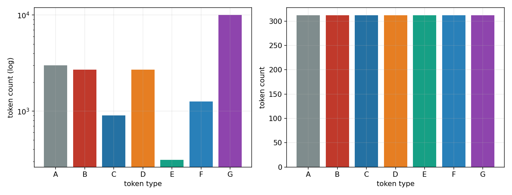

*그림 1.* 토큰 유형(A~G, 가로축)별 표본 수. **왼쪽**은 원본 census(세로축 로그 스케일),
**오른쪽**은 균형화 후 census. 색은 토큰 유형(빨강=B 공격, 주황=D 공격, 파랑계열=양성 통제,
회색=A reference)이며 이후 모든 그림에서 동일하게 사용한다.

- 원본 census는 매우 불균형하다: G(일반) 10,036개, A 3,000개, B·D 각 2,700개, F 1,264개,
  C 900개, E 312개 등 총 20,912행.
- hc_3는 `extract_summary.json`의 `balanced_row_ids`를 사용해 **각 유형을 정확히 312개로
  맞춘다**(오른쪽). 따라서 분석에 들어가는 균형 표본은 7×312 = 2,184행이며, `pos_offset`
  하나당 1,092행(=7×156)이 사용된다. 이진 학습 대상은 A를 뺀 936행
  (positive 312 = B 156 + D 156, negative 624 = C·E·F·G 각 156).
- 효과: 클래스 불균형이 제거되어 아래 AUC·balanced-accuracy 수치가 분포 편향 없이 해석된다.

### 1.3 공격 자체의 위력(방어 전 베이스라인 ASR)

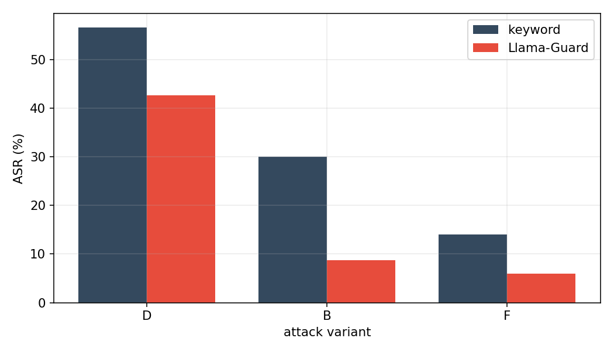

*그림 2.* 공격 변이별 공격 성공률(ASR, %). 가로축 D=malicious_special, B=malicious_mimicry,
F=positioned_regular. 회색 막대는 단순 거절 키워드 판정, 빨강 막대는 Llama-Guard 판정.

- `asr_summary.json` 기준: **D(특수 토큰 직접 주입)가 가장 강력**하다 — 키워드 56.7%, Guard 42.7%.
- B(모방형)는 키워드 30.0% / Guard 8.7%, F(평범 단어 위치 통제)는 14.0% / 6.0%로 약하다.
- 즉 방어가 막아야 할 핵심 위협은 D, 그 다음이 B이며, hc_3의 두-분기 설계(Stage 10)가
  B/D를 분리해 다루는 이유가 여기에 있다. 이후 방어 스테이지의 "ASR after"는 이 베이스라인을
  얼마나 0으로 끌어내리는지로 평가한다.

---

## 2. Stage 08 — Active SinkProbe (토큰 단위 탐지기)

### 2.1 무엇을 했나

`stages/08_active_sinkprobe.py` + `core/active_features.py`. 각 토큰 행에 대해 다음
**400차원** 피처를 만들고 **L1 희소 로지스틱 회귀**를 학습한다(검증은 프롬프트 단위 grouped 5-fold CV).

- **기본 스칼라(레이어별)**: `sink`(헤드 평균 싱크 점수), `value_norm`, `output_norm`,
  `hidden_norm`. 어텐션 32층 + hidden 33층.
- **"Active" 싱크 피처**: `active_value = sink × value_norm`, `active_output = sink × output_norm`.
  → "싱크가 강하면서 그 값/출력 norm까지 큰가"를 잡으려는 계산적(activeness) 결합 피처.
- **프롬프트 내 순위 피처**: `sink_rank_pct`(같은 프롬프트·같은 pos_offset 안에서 싱크 점수의
  내림차순 백분위), `sink_top{1,2,3,5,10}` 플래그(프롬프트 내 상위 k 여부).
- **궤적 요약**: early/middle/late 레이어 밴드 평균, max, last−first 차분.
- NaN/inf는 0으로 치환. 학습 라벨은 §1.1의 B∪D=1, C·E·F·G=0, A=−1(제외).

> 방법 주석(README): 현재 hc_2 산출물은 헤드 평균 싱크만 저장하므로, 순위/top-k는 "분석된
> 토큰들 사이"에서 계산하는 **labeled-token SinkProbe**다. 전체 토큰·헤드별 싱크가 저장되면
> 더 강한 프로브가 가능하다(향후 과제).

### 2.2 결과: 거의 완벽한 토큰 분리

| | pos0 | pos1 |
|---|---:|---:|
| CV AUC | **0.99887** | **0.99904** |
| balanced accuracy | 0.98878 | 0.98798 |
| split / folds | group / 5 | group / 5 |
| n (pos / neg) | 936 (312 / 624) | 936 (312 / 624) |

검증이 **프롬프트 단위 GroupKFold**이므로 같은 프롬프트가 학습/평가에 동시에 들어가지 않는다.
즉 위 AUC는 토큰 단위의 정직한 일반화 추정치다.

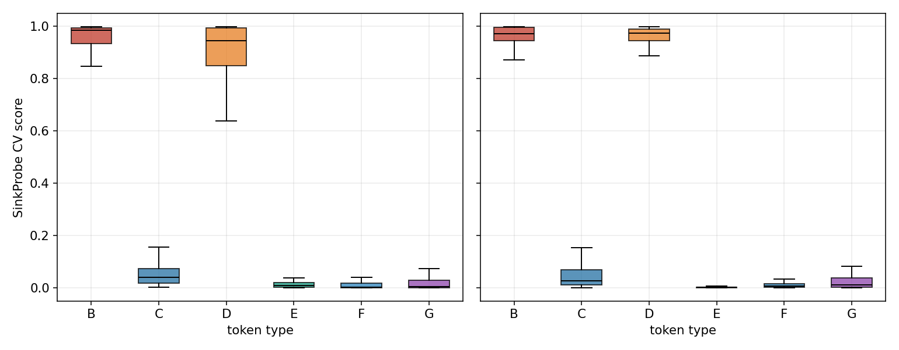

*그림 3.* 토큰 유형별 out-of-fold 프로브 점수 분포(박스플롯). 왼쪽 pos0, 오른쪽 pos1.
박스 색은 그림 1과 동일. 점수 1에 가까울수록 "공격"으로 판정.

- **공격(B, D)은 거의 1.0, 양성(C, E, F, G)은 거의 0.0**으로 깔끔하게 양분된다.
  per-letter 평균(pos0): B 0.953, D 0.898 vs C 0.061, E 0.039, F 0.037, G 0.054.
  pos1에서는 분리가 더 선명하다(E 0.005, F 0.016).
- D(주황)는 B(빨강)보다 하단 꼬리가 약간 길다(pos0에서 중앙값 0.944, 일부 0.64까지 내려옴) —
  특수 토큰 공격 중 탐지가 애매한 소수가 있음을 시사.

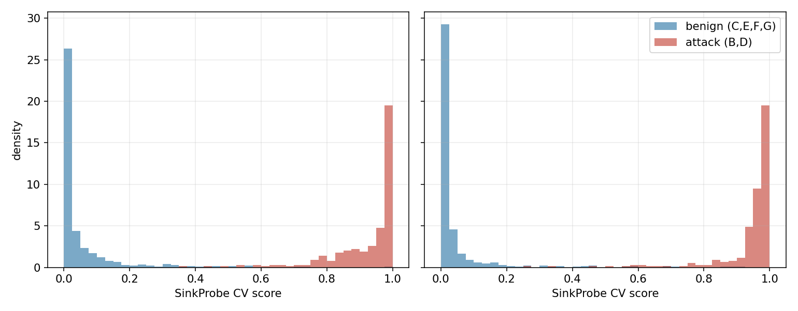

*그림 4.* 프로브 점수의 밀도 히스토그램. 파랑=양성(C,E,F,G), 빨강=공격(B,D). 왼쪽 pos0, 오른쪽 pos1.

- 두 분포가 **0 근처와 1 근처로 완전히 양극화**되어 중간 영역이 거의 비어 있다. 이 분리의 깨끗함이
  뒤(Stage 09/10)에서 임계값만 잡으면 ASR이 0으로 떨어지는 이유다.

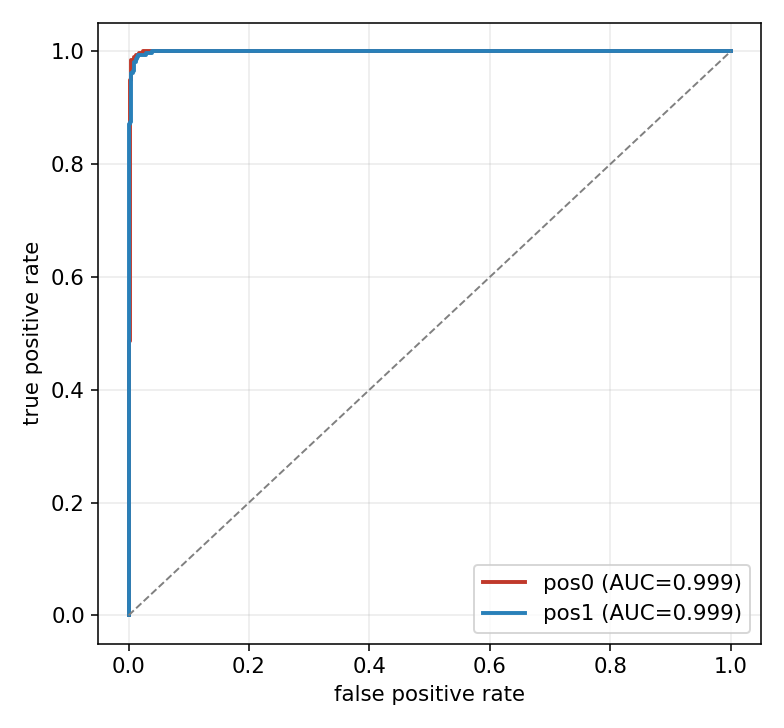

*그림 5.* 토큰 단위 out-of-fold 점수의 ROC 곡선(빨강 pos0, 파랑 pos1, 점선=무작위 기준).
범례의 AUC는 두 위치 모두 ≈ 0.999.

### 2.3 어떤 피처가 신호를 만드나 (가장 중요한 분석 포인트)

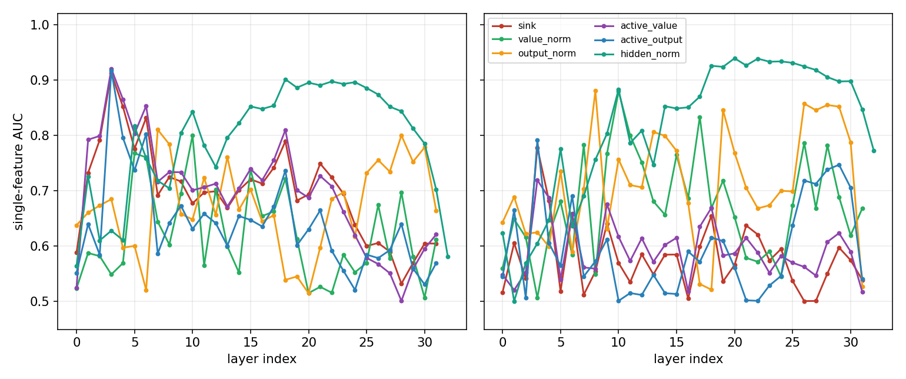

*그림 6.* **레이어별 단일 피처 AUC**(방향 무관 분리력, 0.5=무신호). 왼쪽 pos0, 오른쪽 pos1.
가로축 레이어 인덱스, 곡선 색=피처 패밀리(범례). 이 그림이 hc_3 결과 해석의 핵심이다.

- **`hidden_norm`(청록)이 중후반 레이어(약 L17~L28)에서 단독으로 AUC 0.88~0.94**로 가장 높다.
  즉 탐지력의 상당 부분이 "어텐션 싱크"가 아니라 **잔차 스트림(hidden state)의 norm 크기**에서 나온다.
- **순수 `sink`(빨강)**는 초기 레이어(L3~L4)에서만 잠깐 AUC ~0.91로 솟고, 나머지 구간은 약하다.
  `active_value`(보라)·`active_output`(파랑)도 L3 부근에서만 강하다.
- `value_norm`·`output_norm`은 산발적으로 중간 신호를 낸다.

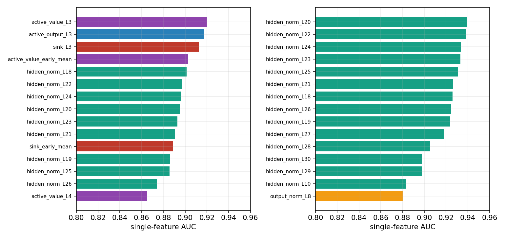

*그림 7.* 단일 피처 AUC 상위 15개(왼쪽 pos0, 오른쪽 pos1). 막대 색=피처 패밀리(그림 6 범례와 동일).

- pos0 상위: `active_value_L3`(0.920), `active_output_L3`(0.917), `sink_L3`(0.912),
  `active_value_early_mean`(0.903), 이어서 `hidden_norm_L18~L26`(0.87~0.90).
- pos1 상위: **거의 전부 `hidden_norm_L18~L27`(0.91~0.94)** — pos1에서는 hidden_norm이 더 지배적.

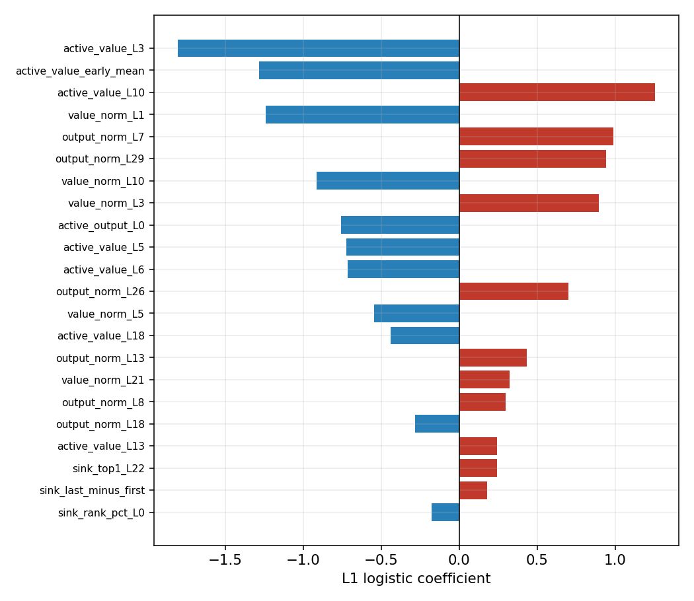

*그림 8.* pos0 L1 로지스틱의 0이 아닌 계수 상위(절댓값 기준 22개). 빨강=양(+, 공격 방향),
파랑=음(−, 양성 방향). 세로 0선 기준.

- 가장 큰 음의 계수는 `active_value_L3`(−1.81), `active_value_early_mean`(−1.28), `value_norm_L1`(−1.24):
  **초기 레이어의 active_value/value_norm이 작을수록 공격**으로 본다(`direction=lower_is_attack`와 일치).
- 양의 계수는 `active_value_L10`(+1.25), `output_norm_L7/L29`(+0.99/+0.94) 등 중후반 norm 항들.
- 즉 프로브는 "초기 레이어 norm은 낮고, 특정 중후반 레이어 norm/output은 높은" 비대칭 패턴을 학습한다.
  단일 싱크 top-k 플래그(`sink_top*`)의 계수는 매우 작아(≤0.24) 보조적 역할에 그친다.

**해석 요약**: "Active SinkProbe"라는 이름과 달리, 실제 판별력은 어텐션 싱크 자체보다
**hidden state norm + 초기 레이어 value norm**에서 나온다. 이는 hc_2가 보고한
"내부 표현 분리가 거의 완벽(AUC~1.0)"이라는 사실(MEMORY [[hc2-key-findings]])과 정합적이며,
hc_2에서 *순수 싱크 게이트*가 실패한 이유와 hc_3 프로브가 성공하는 이유를 동시에 설명한다(§7).

---

## 3. Stage 09 — Prompt-Level Aggregation (프롬프트 단위 집계)

### 3.1 무엇을 했나

`stages/09_prompt_aggregation.py`. Stage 08의 토큰 점수를 프롬프트(`sample_index`) 단위로 모은 뒤
프롬프트 차단 결정을 내린다. "토큰 단위 FPR이 좀 있어도 최종 결정이 프롬프트 단위면 견딜 수 있는가?"를 검증.

- 먼저 **토큰 임계값**을 토큰 recall 0.95 지점으로 설정(pos0 0.740, pos1 0.772).
- 프롬프트 피처 6종: `max, mean, top3_mean, std, count_above_token_threshold, frac_above_token_threshold`.
- 프롬프트를 약 2/3 학습 / 1/3 평가로 분할(전체 761 프롬프트 → train 507 / test 254).
- 두 전략을 평가(모두 held-out test 기준):
  - **A: token-any-prompt-block** — 임계값 초과 토큰이 1개 이상이면 차단.
  - **B: prompt-logreg** — 프롬프트 피처로 로지스틱을 학습하고 프롬프트 FPR 목표 0.01에서 임계값 설정.

### 3.2 결과

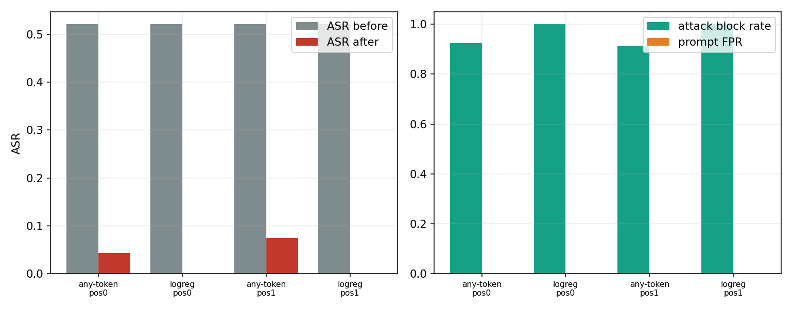

*그림 9.* **왼쪽**: 전략·위치별 방어 전(회색) vs 후(빨강) ASR. **오른쪽**: 공격 차단율(초록) vs
프롬프트 FPR(주황). 가로축 4묶음 = {any-token, logreg} × {pos0, pos1}.

| 전략 | pos | 차단율 | 프롬프트 FPR | ASR before → after | 성공공격 중 차단율 |
|---|---|---:|---:|---:|---:|
| any-token | 0 | 0.926 | 0.000 | 0.521 → **0.043** | 0.918 |
| **prompt-logreg** | 0 | **1.000** | **0.000** | 0.521 → **0.000** | 1.000 |
| any-token | 1 | 0.915 | 0.000 | 0.521 → 0.074 | 0.857 |
| **prompt-logreg** | 1 | **1.000** | **0.000** | 0.521 → **0.000** | 1.000 |

- **프롬프트 로지스틱 집계가 완승**: held-out test에서 공격 프롬프트를 100% 차단하면서
  프롬프트 FPR 0, **ASR을 0.52에서 0으로** 낮춘다(test AUC 1.0).
- 단순 any-token 규칙도 강하지만(차단율 0.92, FPR 0) 성공 공격의 8~14%를 놓친다(ASR 0.043~0.074).
- 흥미롭게도 양쪽 전략 모두 **프롬프트 FPR이 0**이다 — 점수 분포가 그림 4처럼 양극화되어 있어
  recall 0.95 임계값에서도 양성 토큰이 거의 넘지 않기 때문. (Stage 10과의 대비를 §4에서 다룸.)

---

## 4. Stage 10 — Two-Branch Cascade (두 분기 결합 방어)

### 4.1 무엇을 했나

`stages/10_two_branch_cascade.py`. 공격 유형이 이질적(B=깨진 모방 토큰, D=특수 토큰)이므로
**분기를 분리**해 학습한다.

- **B 분기**: B(양성=1) vs C·E·F·G(0), D는 학습에서 제외.
- **D 분기**: D(양성=1) vs C·E·F·G(0), B는 학습에서 제외.
- 결합 점수 = `max(score_B, score_D)`. 임계값은 **학습 split의 양성(benign) 토큰 FPR 0.01** 지점.
- 평가는 **held-out 프롬프트 split**(train 733행 / test 359행, test 263 프롬프트).

### 4.2 결과

분기별 test AUC: pos0 — B 1.0, D 1.0, combined **1.0**. pos1 — B 1.0, D 0.9988, combined **0.9991**.

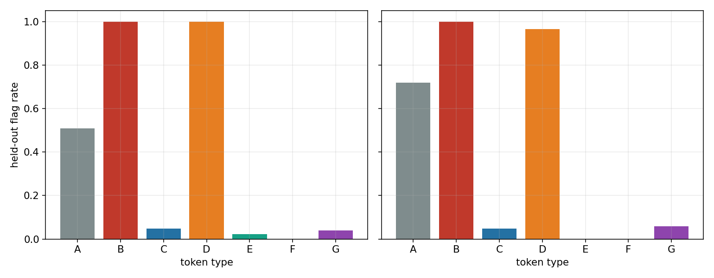

*그림 10.* held-out에서 토큰 유형별 "공격으로 플래그된 비율". 왼쪽 pos0, 오른쪽 pos1. 색은 그림 1과 동일.

| 위치 | A(ref) | B | C | D | E | F | G |
|---|---:|---:|---:|---:|---:|---:|---:|
| pos0 | 0.509 | **1.000** | 0.048 | **1.000** | 0.022 | 0.000 | 0.039 |
| pos1 | 0.719 | **1.000** | 0.048 | **0.964** | 0.000 | 0.000 | 0.059 |

- **공격(B, D)은 거의 전부 플래그**, 양성(C·E·F·G)은 0~6%로 매우 낮다.
- **A(reference)는 pos0 51%, pos1 72%가 플래그된다.** A는 채팅 템플릿 특수 토큰이고 D도 특수 토큰이라
  D-분기가 A를 "특수 토큰"으로 인식하는 것은 자연스러운 거동이다(A는 라벨링에서 제외되므로 FPR에 미포함).
  pos1에서 A 플래그율이 더 오르는 것은 pos1의 D 신호가 더 강함과 일관된다.

프롬프트 단위 결과(공격 프롬프트 105개):

| 위치 | 프롬프트 차단율 | ASR before → after | 토큰 양성 FPR | **프롬프트 FPR** |
|---|---:|---:|---:|---:|
| pos0 | 1.000 | 0.476 → **0.000** | 0.026 | **0.118** |
| pos1 | 0.990 | 0.476 → **0.000** | 0.026 | **0.118** |

- 방어 성능 자체는 강력하다: held-out 공격 프롬프트를 99~100% 차단, **ASR을 0으로**.
- 그러나 **프롬프트 FPR이 0.118**로 Stage 09(0.0)보다 크게 나쁘다. 이유는 다중비교 팽창이다:
  토큰 단위 FPR을 1%로 잡아도, 양성 프롬프트 하나에 토큰이 여러 개 있고 "하나라도 의심되면 차단"하면
  프롬프트 수준에서 오탐이 누적된다(토큰 FPR 2.6% → 프롬프트 FPR 11.8%).
- **결론**: 같은 토큰 탐지기라도, *집계 방식*이 운영 FPR을 좌우한다. Stage 09의 프롬프트-로지스틱처럼
  프롬프트 수준 결정을 별도로 학습하면 FPR 0이 가능하지만, Stage 10의 단순 "max + 토큰 FPR 임계값"
  방식은 11.8%의 양성 프롬프트를 잘못 막는다. 실서비스라면 Stage 09식 집계가 바람직하다.

---

## 5. Stage 11 — Counterfactual 검증 (짝지은 통제 비교)

### 5.1 무엇을 했나

`stages/11_counterfactual_validation.py`. 기본 모드는 **artifact_paired_proxy**다 — 새 forward pass 없이,
*같은 prompt_idx*에서 공격 토큰과 통제 토큰의 프로브 점수를 짝지어 차이(delta)를 본다.
정의된 쌍: B−C, B−F, D−E, D−F (각 prompt_idx에서 letter별 최고 점수 토큰을 대표로 사용).

또한 향후 "진짜 counterfactual"(공격 문장의 토큰을 안전 토큰으로 *직접 치환*하여 재추출)을 위한
`counterfactual_manifest.jsonl`(300행)을 남긴다. 현재 리포트는 그 proxy에 해당한다.

### 5.2 결과

| 위치 | 쌍 | n | 평균 delta | 중앙값 | delta>0 비율 | paired AUC |
|---|---|---:|---:|---:|---:|---:|
| pos0 | B−F | 128 | 0.916 | 0.969 | **1.000** | **1.000** |
| pos0 | D−F | 128 | 0.860 | 0.909 | 0.992 | 0.9995 |
| pos1 | B−F | 128 | 0.947 | 0.961 | **1.000** | **1.000** |
| pos1 | D−F | 128 | 0.930 | 0.963 | **1.000** | **1.000** |

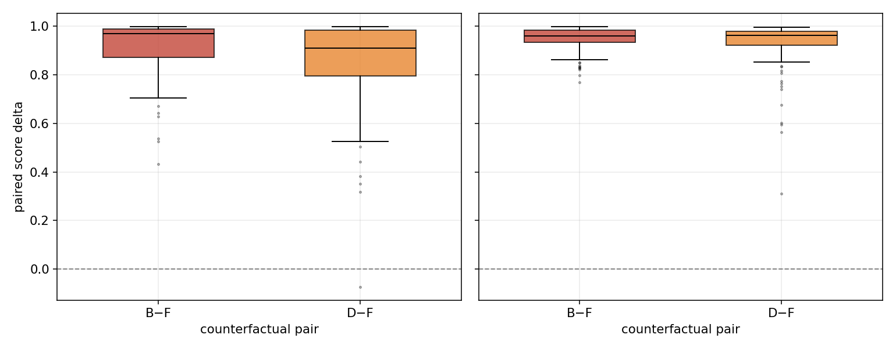

*그림 11.* 짝지은 점수차(공격 − 통제) 분포. 왼쪽 pos0, 오른쪽 pos1. B−F(빨강), D−F(주황).
점선 0선 위쪽이면 공격 토큰 점수가 더 높음을 의미.

- **거의 모든 쌍에서 delta가 강하게 양수**(중앙값 0.9 이상). 즉 동일 프롬프트 맥락에서
  공격 토큰만 점수가 치솟는다. paired AUC는 사실상 1.0.

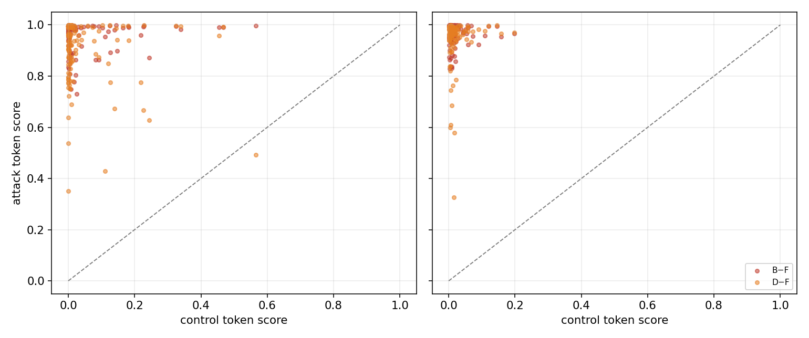

*그림 12.* 통제 토큰 점수(가로) vs 공격 토큰 점수(세로) 산점도. 왼쪽 pos0, 오른쪽 pos1.
점선=대각선(y=x). B−F 빨강, D−F 주황.

- **점들이 거의 전부 좌상단**(통제≈0, 공격≈1)에 몰려 대각선 위쪽에 위치한다. pos1(오른쪽)에서
  더 극단적으로 좌상단에 응집한다. 소수의 D−F 점만 공격 점수가 0.3~0.6으로 내려온다(탐지 애매 사례).

### 5.3 주의점 (코드가 명시한 한계)

- 실험 결과에는 **B−F, D−F만** 채워졌다(각 128행, 합 256). 정의상 B−C, D−E 쌍도 있으나
  `prompt_idx`가 겹치는 짝이 없어 delta 표에 잡히지 않았다. 따라서 "토큰 정체성 통제(C/E)"에 대한
  paired 비교는 이 산출물에서 빠져 있고, 위치 통제(F) 대비 결과만 확인된 셈이다.
- 이는 **진짜 in-place 토큰 치환이 아니라** "같은 프롬프트의 다른 토큰" 비교다. 코드 주석도
  "deltas compare existing paired controls ... they do not replace tokens in-place"라고 명시하며,
  진짜 반사실 검증은 manifest로 향후 재추출해야 한다고 적는다. → §7의 일반화 한계와 직결.

---

## 6. pos0 vs pos1 비교 정리

| 지표 | pos0 | pos1 | 비고 |
|---|---:|---:|---|
| Stage08 CV AUC | 0.99887 | 0.99904 | 사실상 동일, pos1 미세 우위 |
| 지배 피처 | active_value/sink(L3) + hidden_norm | **hidden_norm(L18~27) 압도** | pos1에서 내부 norm 신호가 더 깨끗 |
| Stage09 logreg ASR after | 0.000 | 0.000 | 동일 |
| Stage10 combined AUC | 1.000 | 0.9991 | pos1 D-분기 0.9988로 미세 하락 |
| Stage10 A 플래그율 | 0.509 | 0.719 | pos1에서 특수토큰 민감도↑ |
| Stage10 프롬프트 FPR | 0.118 | 0.118 | 동일(집계 방식 문제) |
| Stage11 paired AUC | ~1.0 | 1.0 | pos1이 더 극단적 분리 |

두 위치 모두 결론은 같다: **토큰 분리는 거의 완벽, 방어는 ASR을 0으로 낮춤, 단 집계 방식이 FPR을 좌우.**

---

## 7. 종합 해석 — 왜 잘 되는가, 그리고 무엇이 함정인가

**(1) 성공의 실체는 "내부 표현 분리"다.**
그림 6~8이 보여주듯, 프로브의 판별력 대부분은 `hidden_norm`(중후반 레이어)과 초기 레이어
`value_norm/active_value`에서 나온다. 순수 어텐션 싱크(`sink_*`)는 L3~L4에서만 잠깐 기여한다.
이는 MEMORY의 hc_2 발견 — "내부 표현 분리는 거의 완벽(AUC~1.0)이지만 §3 싱크 게이트와
§4 캐스케이드는 held-out에서 실패" [[hc2-key-findings]] — 과 정확히 맞물린다. 즉 hc_3가
hc_2의 캐스케이드와 달리 성공하는 이유는 **싱크가 아니라 풍부한 내부-norm 피처를 함께 썼기 때문**이다.
"Active SinkProbe"라는 명칭은 다소 오해의 소지가 있다 — 실제로는 *내부 표현 norm 프로브*에 가깝다.

**(2) 그래서 이 탐지가 "공격"을 잡는지, "토큰 정체성"을 잡는지가 불분명하다.**
공격 토큰 B는 깨진 치환 토큰(`ÃŃch`, `�`), D는 문자 그대로의 특수 토큰(`<|eot_id|>`)이고,
통제 토큰 F/G는 평범한 영어 단어(`pineapple`)다. 표현 norm은 이런 **OOV·특수 토큰에서 자연히
달라진다.** 따라서 프로브가 분리하는 것이 "탈옥 의도"인지, 단순히 "이상한/특수한 토큰 정체성"인지
이 데이터만으로는 구분되지 않는다. Stage 11이 *진짜* in-place 치환이 아니라 paired proxy인 점,
그리고 B−C/D−E(토큰 정체성 통제) 쌍이 비어 있는 점이 이 의심을 해소하지 못한다.

**(3) 운영 FPR은 집계 설계가 결정한다.**
같은 토큰 탐지기인데 Stage 09(프롬프트 로지스틱)는 프롬프트 FPR 0, Stage 10(max+토큰 FPR 임계)은
0.118이다. 토큰 단위 FPR(2.6%)이 프롬프트당 다수 토큰을 거치며 11.8%로 팽창했다. 실배포라면
**프롬프트 수준 결정을 따로 학습**하는 Stage 09 방식이 필수적이다.

**(4) A(reference)의 높은 플래그율**은 D-분기가 "특수 토큰"이라는 표면적 속성에 반응함을 보여준다.
이는 곧 정상적인 채팅 템플릿 토큰(A)도 오탐될 수 있다는 신호이며, 실제 대화 파싱 단계에서
특수 토큰을 어떻게 제외/처리하느냐가 실용 FPR에 영향을 준다.

### 한계와 향후 과제
- **진짜 counterfactual 미수행**: `counterfactual_manifest.jsonl`(300행)로 공격문↔안전문 토큰을
  실제 치환해 재추출하면, 이 신호가 의미(공격)인지 토큰 정체성인지 분리 검증이 가능하다.
- **헤드/전체 토큰 싱크 미저장**: 현재는 헤드 평균 싱크만 있어 순위/top-k가 "분석된 토큰들 사이"로
  제한된다. 전체 토큰·헤드별 싱크를 저장하면 더 진정한 SinkProbe가 가능(README 명시).
- **B−C, D−E paired 비교 누락**: prompt_idx 정합 문제로 토큰 정체성 통제 쌍이 빠졌다.
- **단일 모델(Llama-3.1-8B), 단일 데이터셋**: 다른 모델/탈옥군에 대한 일반화는 미검증.

---

## 8. 결론

experiments_hc_3는 hc_2 산출물 위에서 4단계 방어를 검증했다:

1. **Active SinkProbe**: 토큰 단위 공격 탐지 CV AUC ≈ 0.999, 공격/양성 점수가 0과 1로 양극화.
2. **Prompt Aggregation**: 프롬프트 로지스틱 집계로 held-out **ASR 0.52 → 0.00, 프롬프트 FPR 0**.
3. **Two-Branch Cascade**: B/D 분기 결합으로 공격 차단율 ≈ 1.0, **ASR → 0.0**. 단 단순 집계 탓에
   프롬프트 FPR 0.118.
4. **Counterfactual proxy**: paired AUC ≈ 1.0, 공격 토큰만 점수 급등.

**숫자만 보면 방어는 사실상 완벽하다.** 그러나 (i) 판별력의 본질이 어텐션 싱크가 아니라 내부 표현
norm이라는 점, (ii) 비교 대상이 서로 다른 토큰 정체성이라 *토큰-정체성/OOV 탐지*와 구분되지 않는 점,
(iii) 진짜 in-place counterfactual이 아직 수행되지 않은 점에서, **이 완벽함이 "탈옥 의도 탐지"의
완벽함인지는 아직 입증되지 않았다.** 가장 가치 있는 다음 실험은 manifest를 이용한 **진짜 반사실
재추출**과 **B−C/D−E 토큰 정체성 통제 비교**다.

---

### 부록 A. 산출물 매핑

| 그림 | 근거 산출물 |
|---|---|
| 1 | `results/hc3_active_sink/extract_summary.json` |
| 2 | `results/hc3_active_sink/asr_summary.json` |
| 3,4,5 | `pos{0,1}/active_sinkprobe_scores.jsonl` |
| 6 | `pos{0,1}/active_sinkprobe_features.npz` (레이어별 단일 피처 AUC 재계산) |
| 7,8 | `pos{0,1}/active_sinkprobe_report.json` (top_single_features, top_coefficients) |
| 9 | `pos{0,1}/prompt_aggregation_report.json` |
| 10 | `pos{0,1}/two_branch_cascade_report.json` |
| 11,12 | `pos{0,1}/counterfactual_paired_deltas.csv` |

그림 재생성: `python results_report_claude/make_figures.py` (repro_mb/experiments_hc_3 기준).
