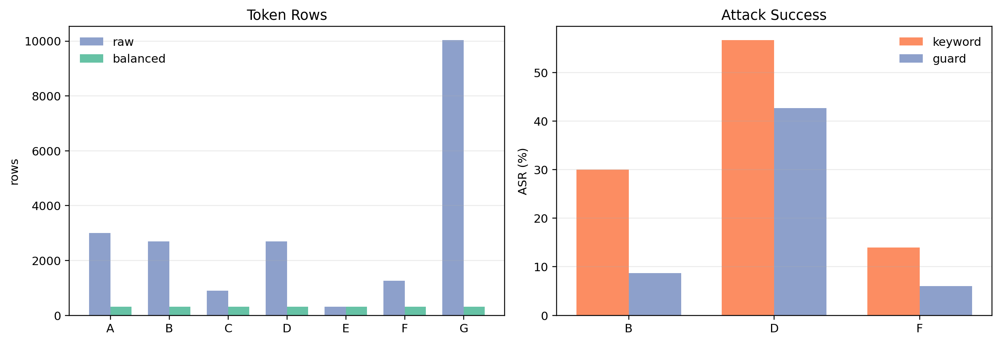
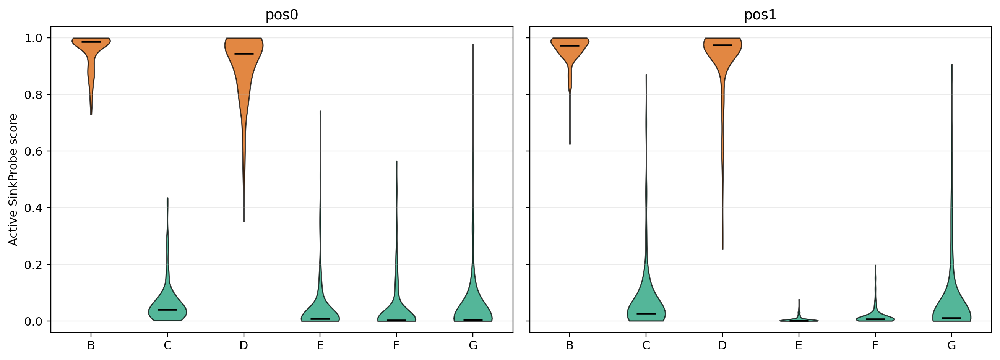
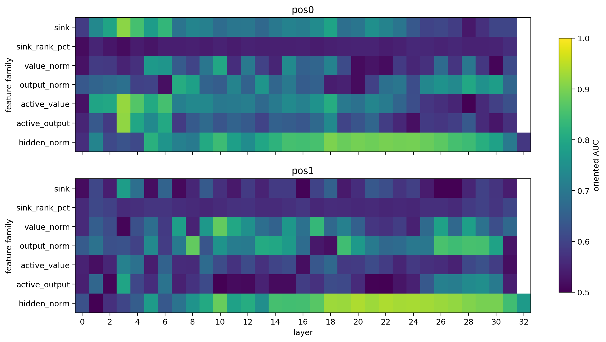
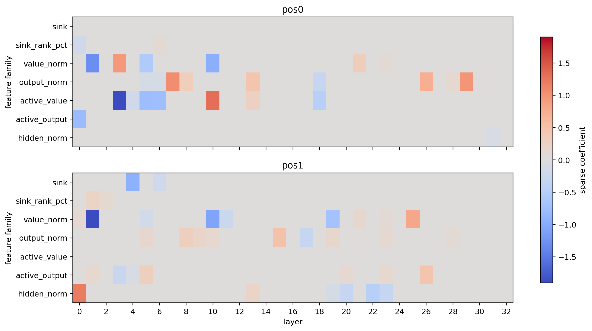
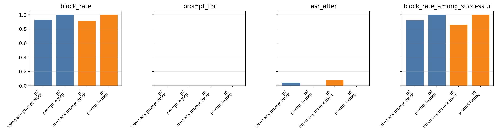
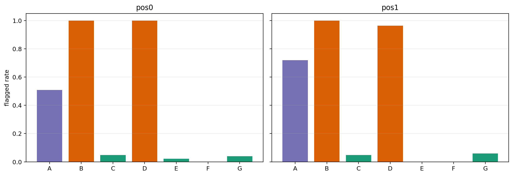
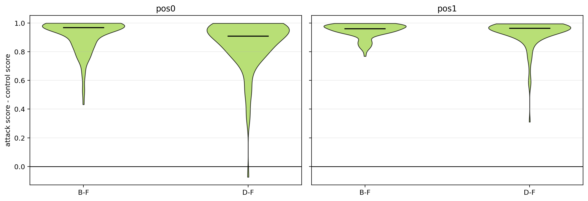

# experiment_hc_3 분석 리포트

## 0. 요약

hc_3는 hc_2에서 실패했던 “sink hard gate cascade”를 버리고, attention sink를 **차단용 1차 필터**가 아니라 **내부 이상 패턴 feature**로 재구성한 실험이다. 실험 순서는 다음과 같다.

1. Active SinkProbe
2. Prompt-Level Aggregation
3. Two-Branch Cascade
4. Counterfactual validation proxy

핵심 결론은 명확하다. **Active SinkProbe + Prompt-Level Aggregation 조합은 현재 hc_3 결과에서 가장 강한 방어 후보**다. pos0/pos1 모두 prompt-level logreg aggregation이 held-out prompt split에서 attack block-rate 1.0, prompt FPR 0.0, ASR after 0.0을 기록했다. 반면 Two-Branch Cascade는 공격 차단력은 높지만 prompt FPR이 0.11801로 높아, 현재 상태에서는 최종 방어라기보다 branch 진단/보조 feature로 보는 것이 맞다.



## 1. 입력 데이터와 평가 설정

분석 대상은 `experiments_hc_3/results/hc3_active_sink`에 있는 최신 결과다. 이 결과는 hc_2와 호환되는 extraction artifact를 hc_3로 복사한 뒤, model-free 분석 stage 08-11을 수행한 것이다.

데이터 규모:

| 항목 | 값 |
|---|---:|
| raw token rows | 20,912 |
| balanced token rows | 2,184 |
| hidden layers | 33 |
| attention layers | 32 |
| hidden dim | 4,096 |
| cap mode | balanced |
| cap per category/position | 156 |

balanced view에서는 A-G 모든 category가 312개씩 맞춰져 있다. pos0/pos1 각각에서는 전체 1,092 rows가 있고, A reference를 제외한 binary fitting 대상은 936 rows다. positive는 B/D 312개, negative는 C/E/F/G 624개다.

ASR 기준은 `both`이며, Llama-Guard 결과도 포함되어 있다.

| variant | n | keyword ASR | Llama-Guard ASR |
|---|---:|---:|---:|
| B malicious mimicry | 150 | 30.00% | 8.67% |
| D malicious special | 150 | 56.67% | 42.67% |
| F positioned regular | 150 | 14.00% | 6.00% |

F가 완전한 0 ASR이 아니라는 점은 중요하다. F는 position-only negative control이지만, refusal-keyword/guard 기준에서는 일부 성공처럼 보이는 prompt가 존재한다. 따라서 방어 평가는 token-level FPR뿐 아니라 prompt-level ASR after를 같이 봐야 한다.

## 2. Stage 08: Active SinkProbe

Active SinkProbe는 기존의 raw sink score만 쓰지 않고 다음 feature를 함께 사용한다.

| feature group | 의미 |
|---|---|
| `sink` | token이 이후 token들로부터 받는 평균 attention mass |
| `sink_rank_pct` | 같은 prompt/pos_offset 안에서의 sink rank percentile |
| `sink_top{k}` | top-k sink 후보 포함 여부 |
| `value_norm`, `output_norm` | attention value/output의 계산 영향 크기 |
| `active_value` | `sink * value_norm` |
| `active_output` | `sink * output_norm` |
| `hidden_norm` | hidden state norm trajectory |
| trajectory summaries | early/middle/late/max/last-first 요약 |

현재 artifact는 full per-head/all-token attention map이 아니라 labeled-token mean-over-head sink만 저장하고 있다. 따라서 hc_3의 SinkProbe는 “labeled-token SinkProbe”이며, 추후 per-head/all-token extractor로 확장할 수 있다.



### 2.1 분류 성능

| position | Group CV AUC | balanced acc | n | positive | negative |
|---|---:|---:|---:|---:|---:|
| pos0 | 0.99887 | 0.98878 | 936 | 312 | 624 |
| pos1 | 0.99904 | 0.98798 | 936 | 312 | 624 |

결과적으로 B/D와 C/E/F/G는 Active SinkProbe feature 공간에서 거의 완전히 분리된다. 이 결과는 hc_2의 “full hidden representation은 강하지만 scalar cascade는 실패”라는 결론을 업데이트한다. sink를 단일 threshold/gate로 쓰면 약하지만, sink rank, active sink, norm trajectory를 묶으면 매우 강해진다.

### 2.2 Category별 score 분포

| position | B mean | D mean | C mean | E mean | F mean | G mean |
|---|---:|---:|---:|---:|---:|---:|
| pos0 | 0.95334 | 0.89818 | 0.06122 | 0.03865 | 0.03729 | 0.05405 |
| pos1 | 0.96068 | 0.92978 | 0.06869 | 0.00520 | 0.01603 | 0.06997 |

B와 D는 모두 높은 score에 몰려 있고, C/E/F/G는 대부분 낮다. 특히 C는 “같은 mimicry token이 benign context에 있는 경우”라 가장 중요한 confound인데, 평균 score가 pos0 0.06122, pos1 0.06869로 낮게 유지된다. 이는 detector가 token identity만 외운 것이 아니라 context-sensitive 내부 패턴을 잡고 있다는 근거다.

### 2.3 단일 feature 관찰



pos0에서는 active sink 계열이 raw sink보다 약간 더 강하다.

| pos0 top single feature | AUC | direction |
|---|---:|---|
| `active_value_L3` | 0.92044 | lower is attack |
| `active_output_L3` | 0.91716 | lower is attack |
| `sink_L3` | 0.91242 | lower is attack |
| `active_value_early_mean` | 0.90284 | lower is attack |
| `hidden_norm_L18` | 0.90137 | lower is attack |

중요한 점은 direction이 “lower is attack”이라는 것이다. 즉 MetaBreak의 공격 token은 항상 “높은 sink”로 나타나는 것이 아니다. 초반 layer에서 sink/active-sink가 낮아지는 패턴도 공격 신호가 될 수 있다. 이 점 때문에 hc_2의 “sink가 높은 token만 keep” 방식은 구조적으로 recall을 잃기 쉽다.

pos1에서는 hidden norm 중후반 layer가 가장 강하다.

| pos1 top single feature | AUC | direction |
|---|---:|---|
| `hidden_norm_L20` | 0.93929 | lower is attack |
| `hidden_norm_L22` | 0.93871 | lower is attack |
| `hidden_norm_L24` | 0.93367 | lower is attack |
| `hidden_norm_L23` | 0.93312 | lower is attack |
| `hidden_norm_L25` | 0.93109 | lower is attack |

따라서 pos0은 active sink가 특히 중요하고, pos1은 attack effect가 hidden trajectory로 더 선명하게 전파되는 것으로 해석할 수 있다.



## 3. Stage 09: Prompt-Level Aggregation

Prompt-Level Aggregation은 hc_3에서 가장 좋은 결과를 낸 방어 후보이다. token-level detector를 너무 보수적으로 쓰지 않고, prompt 단위로 max/mean/top3/count 등의 feature를 모아 최종 block 여부를 판단한다.



### 3.1 결과

| position | strategy | attack block | prompt FPR | ASR before | ASR after | block@successful |
|---|---|---:|---:|---:|---:|---:|
| pos0 | any-token | 0.92553 | 0.00000 | 0.52128 | 0.04255 | 0.91837 |
| pos0 | prompt-logreg | 1.00000 | 0.00000 | 0.52128 | 0.00000 | 1.00000 |
| pos1 | any-token | 0.91489 | 0.00000 | 0.52128 | 0.07447 | 0.85714 |
| pos1 | prompt-logreg | 1.00000 | 0.00000 | 0.52128 | 0.00000 | 1.00000 |

pos0/pos1 모두 prompt-logreg가 held-out split에서 성공한 공격을 전부 차단했고, benign prompt FPR은 0.0으로 측정되었다.

이 결과가 hc_2 cascade와 다른 이유는 두 가지다.

1. hc_2는 sink를 1차 hard gate로 사용해서 낮은 sink token을 버렸다. hc_3는 sink를 feature로 사용하고, 낮은 sink 이상도 공격 신호로 허용한다.
2. hc_2는 token-level threshold 중심이었다. hc_3는 prompt-level aggregation으로 최종 결정을 내린다.

즉 hc_3의 핵심 성과는 “attention sink score 자체”보다 “sink-derived feature를 prompt-level decision으로 올리는 방식”이다.

## 4. Stage 10: Two-Branch Cascade

Two-Branch Cascade는 B branch와 D branch를 분리한다.

| branch | positive | negative |
|---|---|---|
| B branch | B malicious mimicry | C/E/F/G |
| D branch | D malicious special | C/E/F/G |

그 후 deployment proxy로 `max(B_score, D_score)`를 사용했다.



### 4.1 결과

| position | B branch AUC | D branch AUC | combined AUC | attack block | prompt FPR | ASR after |
|---|---:|---:|---:|---:|---:|---:|
| pos0 | 1.00000 | 1.00000 | 1.00000 | 1.00000 | 0.11801 | 0.00000 |
| pos1 | 1.00000 | 0.99880 | 0.99910 | 0.99048 | 0.11801 | 0.00000 |

Per-type flagged rate:

| position | B | D | C | E | F | G |
|---|---:|---:|---:|---:|---:|---:|
| pos0 | 1.00000 | 1.00000 | 0.04762 | 0.02222 | 0.00000 | 0.03922 |
| pos1 | 1.00000 | 0.96429 | 0.04762 | 0.00000 | 0.00000 | 0.05882 |

Two-Branch는 token-level benign FPR이 0.02591로 낮아 보이지만, prompt-level FPR은 0.11801이다. 즉 token-level에서는 적은 수의 benign token만 flag되지만, prompt 단위로 보면 benign prompt 중 약 11.8%가 최소 하나의 suspicious token을 갖는다.

따라서 현재 Two-Branch Cascade는 최종 방어로 바로 쓰기에는 calibration이 부족하다. 하지만 branch별 분리 가능성이 매우 높기 때문에 다음 두 용도로는 유용하다.

1. B mimicry regular attack과 D literal special misuse의 내부 패턴 차이 분석
2. Prompt aggregation에 들어갈 branch score feature 제공

## 5. Stage 11: Counterfactual Validation Proxy

현재 stage 11은 true counterfactual forward가 아니라 artifact paired proxy다. 즉 prompt 자체를 바꿔 다시 forward한 것이 아니라, 기존 paired control prompt들의 score 차이를 비교한다.



### 5.1 결과

| position | pair | n | mean delta | median delta | frac positive | paired AUC |
|---|---|---:|---:|---:|---:|---:|
| pos0 | B-F | 128 | 0.91611 | 0.96882 | 1.00000 | 1.00000 |
| pos0 | D-F | 128 | 0.85974 | 0.90941 | 0.99219 | 0.99951 |
| pos1 | B-F | 128 | 0.94669 | 0.96079 | 1.00000 | 1.00000 |
| pos1 | D-F | 128 | 0.93046 | 0.96309 | 1.00000 | 1.00000 |

공격 prompt score가 positioned regular control보다 거의 항상 높다. 이는 Active SinkProbe score가 단순 position artifact가 아니라 공격 구조를 반영한다는 강한 근거다.

하지만 현재 delta table에는 B-C, D-E pair가 없다. 이유는 C/E control prompt의 `prompt_idx`가 공격 prompt와 1:1로 직접 매칭되지 않는 구조이기 때문이다. 대신 `counterfactual_manifest.jsonl`에는 true rerun용 pair가 300개 생성되어 있다. 다음 단계에서는 이 manifest를 사용해서 실제 counterfactual forward를 수행해야 한다.

## 6. 종합 평가

### 6.1 가장 성공적인 방법

현재 최고 조합은 다음이다.

```text
Active SinkProbe -> Prompt-Level Aggregation
```

이 조합은 다음 조건을 동시에 만족했다.

| 조건 | 결과 |
|---|---|
| B/D 분리 | Group CV AUC 약 0.999 |
| C confound 억제 | C mean score pos0 0.06122, pos1 0.06869 |
| prompt-level block | pos0/pos1 모두 1.0 |
| prompt FPR | pos0/pos1 모두 0.0 |
| ASR after | pos0/pos1 모두 0.0 |

따라서 hc_3 결과만 보면, “sink score는 gate가 아니라 representation feature로 써야 한다”는 가설이 강하게 지지된다.

### 6.2 hc_2 cascade 실패와의 차이

hc_2에서 cascade가 실패한 이유는 sink를 “높으면 의심”이라는 단일 방향 gate로 사용했기 때문이다. hc_3 결과는 공격 신호가 다음처럼 더 복잡하다는 점을 보여준다.

| 관찰 | 의미 |
|---|---|
| pos0 `active_value_L3`가 raw `sink_L3`보다 높음 | sink와 value 계산 영향 결합이 유효 |
| pos0 top features가 lower-is-attack | 공격 token이 항상 high sink는 아님 |
| pos1은 hidden_norm 중후반 layer가 강함 | 공격 효과가 후속 위치에서 hidden trajectory로 전파 |
| prompt aggregation이 token threshold보다 강함 | 방어 단위는 token보다 prompt가 적합 |

즉 attention sink score는 “토큰을 줄이는 필터”가 아니라 “내부 계산 경로의 이상 징후”로 써야 한다.

### 6.3 아직 주의해야 할 점

1. 현재 SinkProbe는 full per-head SinkProbe가 아니다. hc_2 artifact의 한계 때문에 labeled-token mean-over-head sink를 사용한다.
2. prompt aggregation 결과가 매우 좋지만, 아직 완전한 nested validation은 아니다. hyperparameter와 stage 설계가 같은 실험군에서 정해졌기 때문에 독립 test set이 필요하다.
3. Two-Branch Cascade는 prompt FPR 0.11801로 높다. branch score는 최종 차단기보다 보조 feature로 쓰는 것이 적절하다.
4. Counterfactual validation은 아직 proxy다. true counterfactual forward가 필요하다.
5. 현재 결과는 Llama-3.1-8B-Instruct 중심이다. 모델 간 일반화는 아직 검증되지 않았다.

## 7. 다음 진행 방향

### 7.1 바로 해야 할 실험

1. **True counterfactual forward 실행**

   `counterfactual_manifest.jsonl`의 `attack_text`와 `counterfactual_text`를 실제로 다시 forward해서 Active SinkProbe score가 얼마나 변하는지 측정해야 한다. 이 실험이 성공하면 “detector가 단순 correlation이 아니라 attack structure의 causal effect를 본다”는 주장을 만들 수 있다.

2. **Independent prompt split 재실험**

   현재 prompt aggregation은 매우 좋은 결과를 냈지만, 독립 split에서 다시 확인해야 한다. 추천 방식은 prompt index 기준 train/validation/test를 고정하고, threshold와 aggregation model을 validation에서만 선택한 뒤 test를 마지막에 한 번만 보는 것이다.

3. **Sink-only / active-sink-only / hidden-only ablation**

   지금 Active SinkProbe에는 sink, active sink, norm, hidden_norm이 모두 들어간다. 방어 논리를 날카롭게 만들려면 다음 ablation이 필요하다.

   | ablation | 목적 |
   |---|---|
   | sink-only | attention sink 개념만으로 가능한 성능 |
   | active-sink-only | sink × value/output의 기여 |
   | hidden-only | 기존 hidden representation 대비 개선 여부 |
   | no-hidden Active SinkProbe | 실제 경량 monitor 가능성 |

4. **Two-Branch score를 prompt aggregation에 통합**

   Two-Branch 단독 cascade는 prompt FPR이 높지만 branch AUC는 매우 좋다. 따라서 최종 block에는 쓰지 말고, prompt aggregation feature로 `B_branch_max`, `D_branch_max`, `B-D margin`을 추가하는 것이 좋다.

### 7.2 extractor 개선

다음 extractor에서는 아래 artifact를 추가 저장하는 것이 좋다.

| 추가 artifact | 이유 |
|---|---|
| per-head sink tensor | 진짜 SinkProbe-style head/layer selection |
| all-token sink rank | labeled-token rank bias 제거 |
| user/template span mask | template sink displacement 측정 |
| value/output per head | computationally active sink를 더 정확히 계산 |
| counterfactual pair id | B-C, D-E pair delta 자동 계산 |

현재 figure/분석에서 보듯, labeled-token만으로도 성능은 매우 높지만 논문식 주장에는 per-head/all-token 기반이 더 설득력 있다.

### 7.3 최종 방어 후보

현재 기준 최종 방어 설계는 다음이 가장 좋다.

```text
Stage 0: known input-side/L2 guard
Stage 1: Active SinkProbe token scoring
Stage 2: Prompt-Level Aggregation
Stage 3: gray-zone prompt만 full hidden probe 또는 counterfactual rerun
```

여기서 sink는 더 이상 hard gate가 아니다. sink는 active_sink/rank/trajectory feature로 사용되고, 최종 block은 prompt-level에서 결정한다. 이 방향이 hc_2의 실패를 가장 직접적으로 해결한다.

## 8. 생성된 산출물

Figure:

| file | 내용 |
|---|---|
| `fig01_data_asr.png` | 데이터 규모와 ASR baseline |
| `fig02_active_sinkprobe_scores.png` | B-G score 분포 |
| `fig03_feature_auc_heatmap.png` | feature family/layer별 AUC |
| `fig04_prompt_aggregation.png` | prompt aggregation 성능 |
| `fig05_two_branch_per_type.png` | two-branch per-type flagged rate |
| `fig06_counterfactual_deltas.png` | paired-control delta 분포 |
| `fig07_sparse_coefficients.png` | sparse probe coefficient 구조 |

Report/figure 생성 스크립트:

```powershell
python experiments_hc_3\results_report\make_figures.py
```

